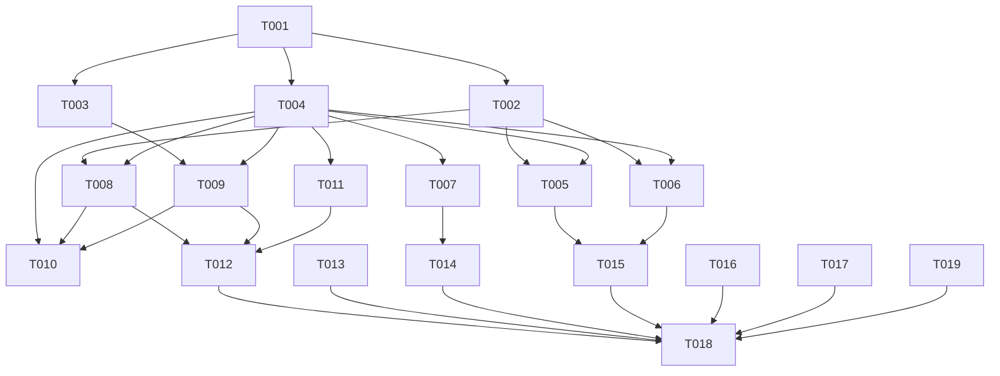
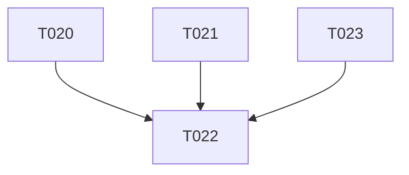
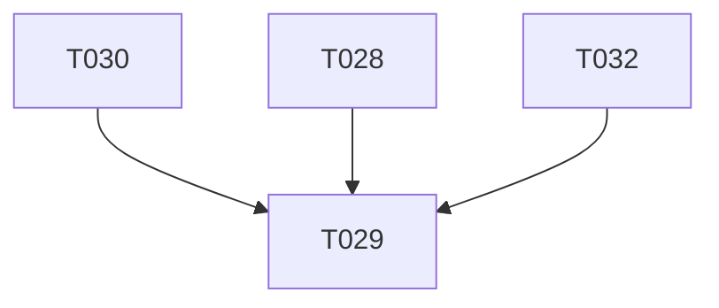
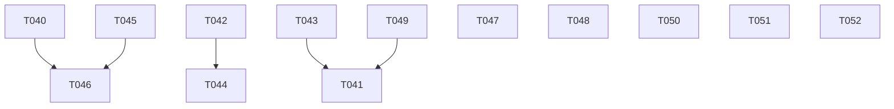
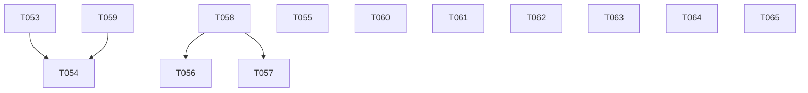

# Tasks: C001

## Metrics

| Metric | Value |
|--------|-------|
| Total tasks | 65 |
| Parallelizable | 41 tasks |
| User stories | US1 |
| Phases | 10 |

## Phase 1: Setup

- [x] T001 [S] Create project structure: `build.zig`, `build.zig.zon`, directory tree (`src/domain/`, `src/application/`, `src/infrastructure/persistence/`, `src/infrastructure/protocol/`, `src/interfaces/`), stub `src/main.zig`
  - Acceptance: `zig build` compiles with empty main, all directories exist

## Phase 2: Foundational — Domain Types

- [x] T002 [M] [P] Implement Job entity and JobStatus enum in `src/domain/job.zig` with co-located tests (set/get, get_to_execute time filtering, sequential modifications — port 3 Rust tests)
  - Acceptance: Job struct with status transitions, timestamp fields as `i64` nanos; tests cover happy path + status filtering
- [x] T003 [S] [P] Implement Rule type in `src/domain/rule.zig` with co-located tests (supports() pattern matching with weight, non-matching patterns)
  - Acceptance: Rule struct with pattern field and `supports()` method; tests cover match + non-match cases
- [x] T004 [M] [P] Implement Runner tagged union in `src/domain/runner.zig`, Instruction enum in `src/domain/instruction.zig`, Query request/response in `src/domain/query.zig`, Execution request/response in `src/domain/execution.zig`, barrel file `src/domain.zig`
  - Acceptance: Single canonical Runner (shell + amqp variants), all types compile, barrel re-exports all domain types

## Phase 3: US1 — Core Logic (parallel tracks)

- [x] T005 [M] [P] [US1] Implement binary encoder/decoder in `src/infrastructure/persistence/encoder.zig` with co-located tests (encode/decode round-trip for Job and Rule, all Runner variants, invalid data errors — port 2 Rust tests byte-for-byte)
  - Acceptance: Type byte + big-endian u16 string lengths + i64 nanos + status byte format preserved; round-trip tests pass
- [x] T006 [M] [P] [US1] Implement logfile entry parser in `src/infrastructure/persistence/logfile.zig` with co-located tests (4-byte length-prefixed entries, incomplete buffers, max size errors — port 2 Rust tests) + barrel `src/infrastructure/persistence.zig`
  - Acceptance: Length-prefixed encode/parse works; handles partial reads and oversized entries
- [x] T007 [M] [P] [US1] Implement KCP protocol streaming parser in `src/infrastructure/protocol/parser.zig` with co-located tests (simple/quoted strings, backslash escaping, incomplete/invalid buffers — port 13 assertions from Rust) + barrel `src/infrastructure/protocol.zig`
  - Acceptance: Newline-terminated lines parsed into domain Instruction types; all 13 Rust assertion cases ported
- [x] T008 [M] [P] [US1] Implement JobStorage (HashMap + sorted Vec) in `src/application/job_storage.zig` with co-located tests (CRUD, status filtering, ordered insertion by execution time)
  - Acceptance: Jobs stored and retrieved by name; `getToExecute()` returns time-ordered subset
- [x] T009 [M] [P] [US1] Implement RuleStorage in `src/application/rule_storage.zig` with co-located tests (CRUD, pattern-based pairing with priority/weight)
  - Acceptance: Rules stored and matched to jobs via pattern; highest-weight rule wins
- [x] T010 [M] [P] [US1] Implement QueryHandler in `src/application/query_handler.zig` with co-located tests (process Instructions into Query responses using JobStorage + RuleStorage)
  - Acceptance: SET/GET/DELETE/LIST instructions handled; returns appropriate query responses

## Phase 4: US1 — Services & Adapters

- [x] T011 [S] [P] [US1] Implement ExecutionClient (UUID-based tracking) in `src/application/execution_client.zig`
  - Acceptance: Generates 128-bit UUIDs via `std.crypto.random`, tracks triggered job executions
- [x] T012 [M] [US1] Implement Scheduler (Database tick loop service) in `src/application/scheduler.zig` + barrel `src/application.zig`
  - Acceptance: Orchestrates JobStorage + RuleStorage + ExecutionClient per tick; barrel re-exports all application types
- [x] T013 [M] [P] [US1] Implement Channel (bounded, Mutex+Condition) in `src/infrastructure/channel.zig` and framerate Clock in `src/infrastructure/clock.zig` with co-located tests
  - Acceptance: Channel send/receive blocks correctly under contention; Clock ticks at configured framerate
- [x] T014 [M] [P] [US1] Implement Shell runner (subprocess execution) in `src/infrastructure/shell_runner.zig` and TCP server (Controller adapter) in `src/infrastructure/tcp_server.zig`
  - Acceptance: Shell runner spawns child process and captures exit code; TCP server accepts connections and feeds to protocol parser
- [x] T015 [S] [US1] Implement background compression in `src/infrastructure/persistence/background.zig` + barrel `src/infrastructure.zig`
  - Acceptance: Background process compresses logfile entries; AMQP runner stub returns error; barrel re-exports all infrastructure types

## Phase 5: US1 — Entry Point & Wiring

- [x] T016 [M] [US1] Implement minimal TOML config parser in `src/interfaces/config.zig` with co-located tests (3 sections: log.level, controller.listen, database.fsync_on_persist, database.framerate — defaults + validation)
  - Acceptance: Parses flat TOML subset; defaults applied for missing keys; tests cover valid config + missing sections + invalid values
- [x] T017 [M] [US1] Implement CLI entry point in `src/interfaces/cli.zig` (-c/--config arg parsing) + barrel `src/interfaces.zig`
  - Acceptance: Parses CLI args, loads config, returns structured options
- [x] T018 [M] [US1] Wire main.zig: spawn Controller, Database, Processor threads with Channel-based message routing in `src/main.zig`
  - Acceptance: Three threads started, channels connected, graceful shutdown on signal
- [x] T019 [S] [E] [US1] Finalize `build.zig` with all module paths, test steps per layer (`zig build test` runs all co-located tests), and ReleaseSafe optimization option
  - Acceptance: `zig build test` discovers and runs all test blocks; `zig build -Doptimize=ReleaseSafe` produces binary

## Dependencies

## Phase 6: Code Review Fixes (Round 1)

- [x] T020 [M] [P] Fix `Clock.start` in `src/infrastructure/clock.zig`: implement framerate loop with sleep, call callback repeatedly instead of once
  - Acceptance: Clock calls callback at configured framerate; test verifies multiple invocations with measurable timing
- [x] T021 [M] [P] Fix `TcpServer.start` in `src/infrastructure/tcp_server.zig`: implement accept loop, parse KCP frames from connections, route requests/responses via channels. Remove premature `server.deinit()`. Fix broken test
  - Acceptance: TCP server accepts connections in a loop, parses KCP protocol, routes requests/responses via channels; test passes
- [x] T022 [M] Fix `runDatabase` in `src/main.zig`: implement tick loop using Clock at framerate intervals, drain exec_response_ch, poll request_ch for queries, send responses to response_ch
  - Acceptance: Database thread runs a real tick loop; channels are actively read/written
- [x] T023 [S] [P] Fix `ExecutionClient.pull_results` in `src/application/execution_client.zig`: read actual execution responses, match by identifier, report real success/failure instead of hard-coded true
  - Acceptance: pull_results returns actual execution outcomes; test verifies failure propagation
- [x] T024 [S] [P] Fix `background.zig` in `src/infrastructure/persistence/background.zig`: add deinit method, accept allocator parameter in execute, remove unused Status.lost variant
  - Acceptance: No memory leak on Process lifecycle; allocator injected; Status enum has only running/success/failure
- [x] T025 [S] [P] Fix `parser.zig` in `src/infrastructure/protocol/parser.zig`: return ParseResult with empty args slice for zero-argument KCP commands
  - Acceptance: Zero-argument KCP commands parse successfully; test covers empty args case
- [x] T026 [S] [P] Fix `config.zig` in `src/interfaces/config.zig`: add errdefer to free controller_listen allocation on subsequent parse error
  - Acceptance: No memory leak when config parse fails after controller.listen is set
- [x] T027 [S] [P] Cleanup: remove dead Storage struct from `src/domain/job.zig`, rename parseArgs to parse_args in `src/interfaces/cli.zig`, remove redundant tests from `src/domain/runner.zig`
  - Acceptance: No Storage in domain/job.zig; parse_args snake_case in cli.zig; zig build test passes

## Phase 7: Code Review Fixes (Round 2)

### Critical — Runtime non-functional

- [x] T028 [M] Implement `TcpServer.start` accept loop in `src/infrastructure/tcp_server.zig`: call accept() in a loop, parse KCP frames per connection via `src/infrastructure/protocol/parser.zig`, send query.Request to request_channel, read query.Response from response_channel and write KCP reply back to client. Remove premature server.deinit() and discarded `_ =` on channels. Fix test to assert real behavior
  - Acceptance: TCP server accepts connections, parses KCP, routes requests/responses via channels; test passes with testing.allocator
- [x] T029 [M] Fix `src/main.zig` daemon lifecycle: join all 3 thread handles instead of discarding with `_ =`. Block main() until threads exit. Ensure defer deinit() on channels only runs after all threads have stopped. Use testing.allocator in all unit tests instead of page_allocator
  - Acceptance: main() blocks until shutdown; no use-after-free; tests detect leaks
- [x] T030 [M] Fix tick loop logic in `src/main.zig`: move triggered-drain out of TickContext.tick() so execution_client.triggered is not cleared before pull_results() can match responses. Add `Channel(T).tryReceive() ?T` method to `src/infrastructure/channel.zig` and remove the abstraction-breaking tryReceive helper from main.zig
  - Acceptance: Jobs transition from triggered to executed/failed; tryReceive is a Channel method; no direct access to Channel internals from main.zig

### High — Safety & correctness

- [x] T031 [S] [P] Fix `src/infrastructure/persistence/background.zig` compress() safety: accept log directory path as parameter, open files relative to an explicitly-opened Dir handle instead of cwd(). Use atomic rename pattern: write to .tmp, fsync, rename. Extract logfile names as named constants. Fix tests with defer proc.deinit() + testing.allocator
  - Acceptance: No cwd() calls; atomic rename on compress; named constants; tests detect leaks

### Medium — Missing functionality

- [x] T032 [M] Wire persistence into `src/application/scheduler.zig`: import persistence modules, add load(path) to read logfile at startup and restore state into JobStorage/RuleStorage, add logfile append in handle_query for each accepted instruction
  - Acceptance: Scheduler reads logfile on init; new jobs/rules are persisted; round-trip test passes
- [x] T033 [S] [P] Add 3 co-located test blocks to `src/domain/job.zig`: field access/construction, JobStatus enum values, status byte mapping used by encoder (port from Rust tests)
  - Acceptance: 3 test blocks present in job.zig; zig build test passes

### Medium — DRY & conventions

- [x] T034 [S] [P] Merge Encodable and Decoded into a single Entry type in `src/infrastructure/persistence/encoder.zig`. Update encode/decode signatures and all callers
  - Acceptance: Single Entry union(enum) type; no Encodable/Decoded; all tests pass
- [x] T035 [S] [P] Normalize all private function names to snake_case across codebase: parseToken/parseSimpleString/parseQuotedString in `src/infrastructure/protocol/parser.zig`; encodeJob/encodeRule in `src/infrastructure/persistence/encoder.zig`; runController/tryReceive/runDatabase/runProcessor in `src/main.zig`
  - Acceptance: Zero camelCase private functions in codebase; zig build test passes
- [x] T036 [S] [P] Remove unnecessary comments from `src/functional_tests.zig`: file header block and section divider comments
  - Acceptance: No Feature: header; no --- dividers; test names remain descriptive
- [x] T037 [S] [P] Fix `src/interfaces/config.zig` errdefer: add errdefer to free controller_listen allocation on subsequent parse error to prevent memory leak
  - Acceptance: No leak when config parse fails after controller.listen is set; test with testing.allocator detects leaks

## Dependencies (Phase 6)

## Dependencies (Phase 7)

## Phase 8: Validation Fixes

### Medium — Missing functionality

- [x] T038 [M] [US1] Wire persistence into `src/application/scheduler.zig`: add `load(allocator, path) !void` method that reads a logfile at the given path via `infrastructure/persistence/logfile.zig` and `infrastructure/persistence/encoder.zig`, decodes each entry, and restores state into JobStorage/RuleStorage. Add logfile append in `handle_query` for each accepted SET/RULE_SET instruction. Add co-located test that encodes jobs/rules to a buffer, calls `load()`, and verifies storage state
  - Acceptance: `Scheduler.load` reads logfile and restores state; `handle_query` appends to logfile; round-trip test passes with `testing.allocator`
  - Note: T032 was marked DONE in Phase 7 but `load()` was never implemented — this task completes that work

### Low — Test coverage

- [x] T039 [S] [P] [US1] Add direct unit test for `Channel(T).try_receive()` in `src/infrastructure/channel.zig`: test returns `null` on empty channel, test returns value after `send`, test non-blocking behavior (does not deadlock on empty buffer)
  - Acceptance: 2+ test blocks covering try_receive; `zig build test` passes; no deadlock

## Dependencies (Phase 8)

## Phase 9: Code Review Fixes (Round 3)

### Critical — Runtime non-functional

- [x] T040 [M] [US1] Fix `TcpServer.start` in `src/infrastructure/tcp_server.zig`: implement real accept loop — call `server.accept()` in a loop, parse buffered stream with `protocol/parser.zig`, build `query.Request`, send on `request_channel`, receive `query.Response`, write KCP reply back to socket. Remove `_ = request_channel` / `_ = response_channel` discards
  - Acceptance: TCP server accepts client connections, parses KCP protocol, routes requests/responses via channels; integration test connects and receives reply
  - Note: T021 and T028 were marked DONE but accept loop is still stubbed with discarded channels (Review Issue #1)

- [x] T041 [S] [US1] Call `scheduler.load()` from `run_database()` in `src/main.zig`: after `Scheduler.init()`, call `scheduler.load(allocator, logfile_path) catch {}` to restore persisted state on startup. Pass `logfile_path` from config through `DatabaseContext`
  - Acceptance: Persisted jobs/rules are restored on daemon restart; test verifies load is called
  - Note: T032/T038 implemented `load()` on Scheduler but it is never called from `run_database` (Review Issue #2)

- [x] T042 [M] [US1] Fix iterator invalidation in `Scheduler.tick()` in `src/application/scheduler.zig`: `get_to_execute()` returns a borrowed slice from `job_storage`, then `job_storage.set()` calls `orderedRemove()` mutating the same backing array during iteration — on N-job ticks only ceil(N/2) jobs trigger. Copy the slice into an owned allocation (`allocator.dupe`) before the mutation loop, or collect identifiers first then process after releasing the slice
  - Acceptance: All N ready jobs trigger in a single tick; co-located test verifies 3+ concurrent jobs all execute

### High — Safety & correctness

- [x] T043 [S] [US1] Fix `append_to_logfile()` file creation in `src/application/scheduler.zig`: replace `openFile(.write_only)` with `openFile` + fallback `createFile(.{ .truncate = false })` so first write on a fresh install succeeds instead of `FileNotFound`
  - Acceptance: Persistence works on first run without pre-existing logfile; test creates tempdir and verifies write
  - Note: Review Issue #4

- [x] T044 [M] [US1] Fix `handle_query` error propagation in `src/main.zig`: change `handle_query` call site to capture the error result, send `Response{ .request = req, .success = ok }` with actual outcome instead of hardcoded `success: true`. Remove `catch {}` swallow
  - Acceptance: Failed queries return `success: false` to client; test verifies error propagation
  - Note: Review Issue #5

- [x] T045 [S] [US1] Fix `Channel.send()` deadlock on close in `src/infrastructure/channel.zig`: add `self.closed` check in the `while` loop condition — `while (self.count == self.capacity and !self.closed)`. Return error or sentinel when closed to unblock producers. Mirror the pattern already used in `receive()`
  - Acceptance: `send()` on a closed channel unblocks and returns; co-located test verifies no deadlock
  - Note: Review Issue #6

- [x] T046 [M] [US1] Fix daemon shutdown hang in `src/main.zig`: close `exec_request_ch` (and set `running` to false) before `processor_thread.join()` so the processor thread's `receive()` unblocks. Replace manual sequential `deinit` calls at lines 265-268 with `defer` statements in reverse acquisition order per CLAUDE.md
  - Acceptance: Daemon shuts down cleanly without hanging; all threads join within bounded time
  - Note: Review Issues #7, #12

### Medium — Correctness & conventions

- [x] T047 [S] [P] [US1] Fix `background.zig` allocator and filenames in `src/infrastructure/persistence/background.zig`: add `allocator: std.mem.Allocator` parameter to `Process.execute()` instead of hardcoded `page_allocator`; add `pub fn deinit(self: *Process, allocator)` method; pass source/destination filename parameters to `compress()` derived from configured logfile path. Update all call sites
  - Acceptance: No hardcoded `page_allocator`; `deinit` frees process; `compress` uses configured filenames; tests use `testing.allocator`
  - Note: T024 was marked DONE but allocator is still hardcoded; T031 was marked DONE but filenames are still hardcoded (Review Issues #8, #10)

- [x] T048 [S] [P] [US1] Fix zero-argument KCP commands in `src/infrastructure/protocol/parser.zig`: when `input[pos] == '\n'` after command token, return `ParseResult{ .command = cmd, .args = &.{} }` instead of `ParseError.Invalid`. Add co-located test for zero-arg command
  - Acceptance: Zero-argument KCP commands parse successfully; test covers `"LIST\n"` and similar
  - Note: T025 was marked DONE but the fix is absent (Review Issue #9)

- [x] T049 [S] [P] [US1] Fix `std.fs.cwd()` usage on background thread in `src/application/scheduler.zig`: accept `std.fs.Dir` parameter in `load()` and `append_to_logfile()` instead of calling `std.fs.cwd()` directly, matching the pattern in `background.zig compress(allocator, dir)`. Update call sites in `run_database`
  - Acceptance: No `std.fs.cwd()` calls in scheduler.zig; Dir handle passed from caller; tests pass with `testing.tmpDir`
  - Note: Review Issue #11

### Low — Cleanup

- [x] T050 [S] [P] [US1] Wire `database_fsync_on_persist` into logfile flush path in `append_to_logfile` in `src/application/scheduler.zig`, or remove it from `Config` struct and parser in `src/interfaces/config.zig` if not needed. No dead config fields
  - Acceptance: Either fsync flag is used on persist writes, or config field is removed entirely; `zig build test` passes
  - Note: Review Issue #14

- [x] T051 [S] [P] [US1] Rename `Args.parse_args` to `Args.parse_slice` in `src/interfaces/cli.zig` for consistency with peer method naming (verb-only: `handle`, `tick`, `parse`). Update all 5 test call sites
  - Acceptance: No `parse_args` identifier in codebase; tests reference `parse_slice`; `zig build test` passes
  - Note: Review Issue #13

- [x] T052 [S] [P] [US1] Remove unnecessary `errdefer` guards in `decode_inner` in `src/infrastructure/persistence/encoder.zig` that guard allocations after which no fallible operation occurs before `return` — these guard against infallible operations and create false cleanup complexity
  - Acceptance: No `errdefer` on allocations immediately followed by `return`; existing tests still pass
  - Note: Review Issue #15

## Dependencies (Phase 9)

## Phase 10: Code Review Fixes (Round 4)

### Critical — Runtime non-functional

- [x] T053 [M] [US1] Fix `TcpServer.start` in `src/infrastructure/tcp_server.zig`: implement real accept loop — after `addr.listen()`, call `server.accept()` in a loop, read buffered stream, parse KCP lines via `protocol/parser.zig`, construct `query.Request`, send to `request_channel`, await `query.Response` from `response_channel`, write KCP reply back to client socket. Remove `_ = request_channel` / `_ = response_channel` discards and premature `server.deinit()`. Update test to connect a client and verify round-trip
  - Acceptance: TCP server accepts connections, parses KCP protocol, routes requests/responses via channels; test connects and receives reply
  - Note: T021/T028/T040 were all marked DONE but accept loop is still stubbed (Review Issue #1)

- [x] T054 [M] [US1] Fix daemon shutdown in `src/main.zig`: after `controller_thread.join()`, set `running.store(false, .release)` and close `query_request_ch` to unblock `receive()` in the tick loop, so `database_thread.join()` can complete. Ensure `exec_request_ch.close()` happens before `processor_thread.join()`. Move channel `defer deinit()` statements to after all threads have joined
  - Acceptance: Daemon shuts down cleanly; all 3 threads join within bounded time; no use-after-free
  - Note: T029/T046 were marked DONE but `running` is never set to `false` (Review Issue #2)

### High — Safety & correctness

- [x] T055 [S] [US1] Fix `ExecutionClient.drain_pending` in `src/application/execution_client.zig`: track index of successfully sent items and only clear the sent prefix on `error.ChannelClosed` — currently returns early without clearing, causing re-send of already-sent items on next tick (double execution). Add isolated unit test for partial drain
  - Acceptance: Partial drain removes sent items; double-execution impossible; test covers send failure mid-drain
  - Note: Review Issue #3

### Medium — Resource leak & correctness

- [x] T056 [S] [US1] Fix `Scheduler.load()` arena leak in `src/application/scheduler.zig`: before overwriting `self.load_arena`, call `prev.deinit()` on existing arena. Add test that calls `load()` twice and verifies no leak via `testing.allocator`
  - Acceptance: No memory leak on double `load()`; test passes with `testing.allocator`
  - Note: Review Issue #8

- [x] T057 [S] [US1] Fix `handle_query()` return value in `src/application/scheduler.zig`: either propagate the `Response` returned by `handler.handle()` (return it to caller), or change `QueryHandler.handle()` to return `void` if the value is always dead. Remove `_ = try handler.handle(request)` discard
  - Acceptance: No discarded return value; response is either used or method returns void
  - Note: Review Issue #10

### Medium — Conventions & architecture

- [x] T058 [S] [P] [US1] Abstract persistence behind application-level port in `src/application/scheduler.zig`: define a `PersistencePort` interface (or accept encode/decode function pointers) so scheduler no longer imports `../infrastructure/persistence.zig` directly. Move persistence wiring to `src/main.zig` or an adapter
  - Acceptance: `scheduler.zig` has zero imports from `infrastructure/`; hexagonal dependency direction restored
  - Note: Review Issue #4

- [x] T059 [S] [P] [US1] Fix `std.fs.cwd()` in `run_database()` in `src/main.zig`: open the working directory in `main()` before spawning threads (`const cwd = try std.fs.cwd().openDir(".", .{})`) and pass the `Dir` handle through `DatabaseContext` instead of calling `cwd()` inside the background thread
  - Acceptance: No `std.fs.cwd()` call inside any background thread function; `Dir` handle passed from `main()`
  - Note: Review Issue #5 — violates CLAUDE.md rule

- [x] T060 [S] [P] [US1] Document `logfile_dir` ownership contract in `src/application/scheduler.zig`: add doc comment on `Scheduler.load()` stating caller's `Dir` must outlive the `Scheduler`, or change `logfile_dir` to store a path string and reopen per call
  - Acceptance: Ownership documented or dangling handle eliminated; no behavioral change if documenting only
  - Note: Review Issue #9

### Low — Cleanup

- [x] T061 [S] [P] [US1] Remove unused `allocator` parameter from `Args.parse_slice` in `src/interfaces/cli.zig`: remove the parameter and update the call site in `Args.parse()`. No allocation is performed
  - Acceptance: `parse_slice` takes only `args: []const []const u8`; `zig build test` passes
  - Note: Review Issue #6

- [x] T062 [S] [P] [US1] Merge duplicated `layer_tests` loops in `build.zig`: iterate once, create module + test artifact, attach to both `test` step and named per-layer step from the same artifact
  - Acceptance: Single loop over `layer_tests`; same build steps produced; `zig build test` passes
  - Note: Review Issue #7

- [x] T063 [S] [P] [US1] Replace `@constCast` calls in `src/functional_tests.zig` with `allocator.dupe(u8, slice)` to match the ownership pattern used in `encoder.zig`. Use arena allocator scoped to test block if needed
  - Acceptance: Zero `@constCast` in functional_tests.zig; tests pass with `testing.allocator`
  - Note: Review Issue #12

- [x] T064 [S] [P] [US1] Move `default_filenames` constant inside test blocks in `src/infrastructure/persistence/background.zig`: it is only used in tests but declared at module scope, suggesting public API
  - Acceptance: No module-scope `default_filenames`; test blocks declare locally; `zig build test` passes
  - Note: Review Issue #13

- [x] T065 [S] [P] [US1] Remove `// Feature: C001` comment from line 1 of `src/functional_tests.zig`
  - Acceptance: No `// Feature:` comments in codebase
  - Note: Review Issue #14 — T036 was marked DONE but comment persists

## Dependencies (Phase 10)

## Execution Notes

- Tasks marked [P] can run in parallel within their phase
- Phase 3 is highly parallel: persistence (T005-T006), protocol (T007), and application (T008-T010) tracks are independent
- The implement workflow runs `zig build` and `zig build test` automatically between phases — do NOT duplicate as tasks
- Binary persistence format must match Rust byte-for-byte (T005-T006) — use Rust test vectors as oracle
- AMQP runner is stubbed (returns error) per plan decision — shell runner is the priority
- Sizes S/M/L indicate relative complexity, NOT time estimates

