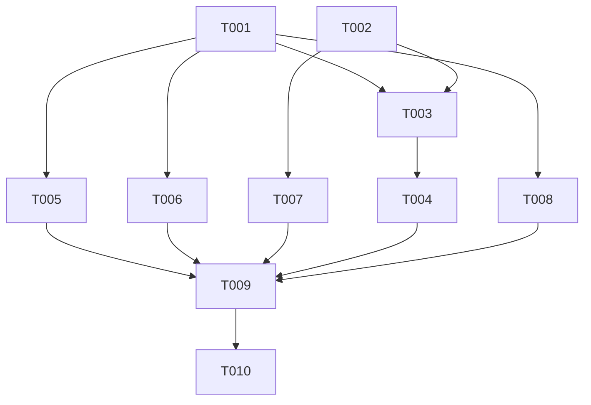

# Tasks: F001

## Metrics

| Metric | Value |
|--------|-------|
| Total tasks | 10 |
| Parallelizable | 4 tasks |
| User stories | US1 |
| Phases | 3 |

## Phase 1: Foundational

- [x] T001 [S] [P] Add `get` variant to `Instruction` tagged union in `src/domain/instruction.zig`
  - Acceptance: `get` variant holds `identifier: []const u8`; compiles with `zig build test-domain`

- [x] T002 [S] [P] Extend `Response` with optional `body` field in `src/domain/query.zig`
  - Acceptance: `body: ?[]const u8 = null` field present; existing SET/RULE SET responses unaffected (body remains null)

## Phase 2: User Story 1 (P1 - Must Have)

- [x] T003 [M] [US1] Add allocator to `QueryHandler` and handle `.get` instruction in `src/application/query_handler.zig`
  - Acceptance: GET existing job returns `response.success == true` with body `"<status> <execution_ns>"`; GET missing job returns `response.success == false` with `body == null`; unit tests for both cases pass

- [x] T004 [S] [US1] Skip GET persistence in scheduler and pass allocator to QueryHandler in `src/application/scheduler.zig`
  - Acceptance: GET instructions do not call `append_to_logfile`; QueryHandler receives allocator at construction; existing SET/RULE SET persistence behavior unchanged

- [x] T005 [S] [US1] Parse `GET` command in `build_instruction()` in `src/infrastructure/tcp_server.zig`
  - Acceptance: `GET <id>` input produces `Instruction{ .get = .{ .identifier = "<id>" } }`

- [x] T006 [S] [US1] Add `get` arms to `is_borrowed_by_instruction()` and `free_instruction_strings()` in `src/infrastructure/tcp_server.zig`
  - Acceptance: Exhaustive switch compiles; GET instruction identifier correctly identified as borrowed; no memory leaked

- [x] T007 [S] [US1] Extend `write_response()` to append body after OK in `src/infrastructure/tcp_server.zig`
  - Acceptance: Response with non-null body writes `<request_id> OK <body>\n`; response with null body writes `<request_id> OK\n` unchanged; `handle_connection` frees `resp.body` via allocator after `write_response()` returns

- [x] T008 [S] [US1] Add `.get` arm to `append_to_logfile()` switch in `src/application/scheduler.zig`
  - Acceptance: Exhaustive switch compiles; `.get => return` skips persistence for GET (no log entry produced); encoder.zig unchanged (operates on `Entry`, not `Instruction`)

## Phase 3: Integration

- [x] T009 [M] [US1] Add functional tests for GET in `src/functional_tests.zig`
  - Acceptance: SET-then-GET round-trip verifies `response.body` matches `"planned <execution_ns>"`; GET nonexistent job returns `response.success == false` with null body; response body memory freed with defer

- [x] T010 [S] [E] [US1] Update protocol docs to move GET from unimplemented to documented in `docs/reference/protocol.md`
  - Acceptance: GET listed under Commands section with full syntax `GET <id>`, response format `<request_id> OK <status> <execution_ns>\n`, and error format; removed from Unimplemented Commands section

## Dependencies

## Execution Notes

- T001 and T002 are independent domain changes — run in parallel
- T005, T006, T007 are infrastructure changes independent of each other — parallelizable after T001/T002
- T008 targets `scheduler.zig:append_to_logfile()` (not encoder.zig) — parallelizable with T005/T006/T007 after T001
- T003 must precede T004 (scheduler needs QueryHandler's new init signature)
- The implement workflow runs `zig build test-all` automatically between phases — do not duplicate
- Sizes S/M/L indicate relative complexity, NOT time estimates

