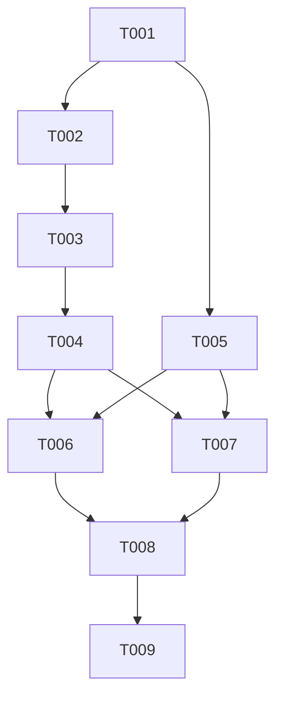

# Tasks: F002

## Metrics

| Metric | Value |
|--------|-------|
| Total tasks | 9 |
| Parallelizable | 4 tasks (T002-T004 ∥ T005, T006 ∥ T007) |
| User stories | US1, US2, US3 |
| Phases | 5 |
| Tags | [S/M/L] = size, [P] = parallelizable, [E] = editorial |

## Phase 1: Foundational

- [x] T001 [S] Add `query` variant with `pattern` field to `Instruction` tagged union in `src/domain/instruction.zig`
  - Acceptance: Unit test verifies `.query` tag and pattern via `expectEqualStrings`; `zig build test-domain --summary all` passes

## Phase 2: User Story 1 (P1 - Must Have)

- [x] T002 [M] [US1] Add `get_by_prefix()` method to JobStorage in `src/application/job_storage.zig`
  - Acceptance: Uses `valueIterator()` + `std.mem.startsWith` filter, returns owned `[]Job` slice; unit tests cover prefix match (2 of 3 jobs), no-match (empty slice), empty prefix (all jobs)

- [x] T003 [M] [US1] Add `.query` dispatch to `QueryHandler.handle()` in `src/application/query_handler.zig`
  - Acceptance: Calls `get_by_prefix()`, formats multi-line body as single `[]const u8` with `<job_id> <status> <exec_ns>\n` per match using `allocPrint` and `@tagName`; unit tests cover match, no-match (null body), multi-match

- [x] T004 [S] [US1] Add `.query` arm to `Scheduler` in `src/application/scheduler.zig`
  - Acceptance: `.query` delegates to QueryHandler; `append_to_logfile()` has `.query => return` (no persistence); unit tests verify query routing and no logfile writes

- [x] T005 [M] [P] [US1] Add QUERY parsing and response support in `src/infrastructure/tcp_server.zig`
  - Acceptance: `build_instruction()` parses `QUERY <pattern>` with `allocator.dupe()` for pattern; `.query` arm in `free_instruction_strings()`; `write_response()` refactored to handle multi-line body (split on `\n`, prefix each line with request_id, append terminal `<request_id> OK\n`); FR-005: inline check in `build_instruction()` detects QUERY with missing pattern and sends `<request_id> ERROR\n` directly before returning null; unit tests cover parse, missing-arg error, multi-line formatting via socketpair

## Phase 3a: Functional Tests (parallel)

- [x] T006 [S] [P] [US1] Write functional test: prefix match returns matching jobs in `src/functional_tests.zig`
  - Acceptance: SET `backup.daily` + `backup.weekly` + `deploy.prod` → `QUERY backup.` → 2 data lines + OK; set-based comparison (no order dependency)

- [x] T007 [S] [P] [US3] Write functional test: no-match returns OK only in `src/functional_tests.zig`
  - Acceptance: SET jobs → `QUERY nonexistent.` → single `<id> OK` line, zero data lines

## Phase 3b: Functional Tests (depends on T006 + T007)

- [x] T008 [S] [US2] Write functional test: empty pattern returns all jobs in `src/functional_tests.zig`
  - Acceptance: SET 3 jobs → `QUERY ""` → 3 data lines + OK

## Phase 4: Cleanup

- [x] T009 [S] [E] Update stale spec reference FR-007 in `.specify/implementation/F002/spec-content.md`
  - Acceptance: FR-007 references only `free_instruction_strings()`, no mention of deleted `is_borrowed_by_instruction()`

## Dependencies

## Execution Notes

- Phase 2 has two parallel tracks: application layer (T002→T003→T004) and infrastructure layer (T005) — both depend only on T001
- Phase 3a tasks T006 and T007 are parallelizable; Phase 3b (T008) starts after both complete
- The implement workflow runs `make lint`, `make test`, `make build` automatically — do NOT duplicate as tasks
- Sizes S/M/L indicate relative complexity, NOT time estimates
- T005 is the riskiest task: `write_response()` refactor must not break existing GET response format — existing GET tests serve as regression guard
- Functional tests (T006-T008) must use set-based comparison since hashmap iteration order is non-deterministic

