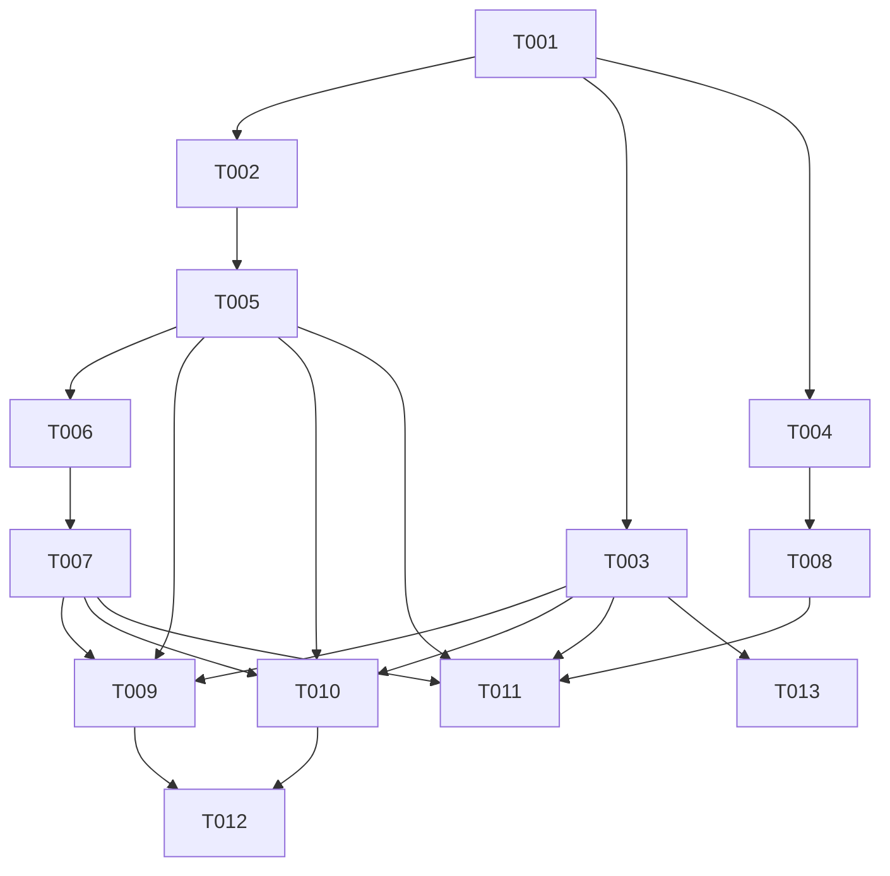

# Tasks: F003

## Metrics

| Metric | Value |
|--------|-------|
| Total tasks | 13 |
| Parallelizable | 6 tasks |
| User stories | US1, US2, US3 |
| Phases | 4 |

## Phase 1: Foundational

- [x] T001 [S] Add `.remove` and `.remove_rule` variants to Instruction tagged union in `src/domain/instruction.zig`
  - Acceptance: Both variants have single `identifier` field; exhaustive switches in domain compile; `zig build test-domain --summary all` passes

## Phase 2: User Story 1 & 2 — Storage and Parsing (P1 - Must Have)

- [x] T002 [S] [P] [US1] Implement `delete(identifier) -> bool` on JobStorage in `src/application/job_storage.zig`
  - Acceptance: Removes from both `jobs` hashmap and `to_execute` list; returns true if existed, false if missing; co-located tests cover delete-existing, delete-from-queue, delete-missing

- [x] T003 [M] [P] [US1,US2] Add REMOVE and REMOVERULE parsing to `build_instruction()` in `src/infrastructure/tcp_server.zig`
  - Acceptance: Parses `REMOVE <id>` and `REMOVERULE <id>` into `.remove`/`.remove_rule` instructions; returns null for missing identifier; `free_instruction_strings()` frees identifier; `handle_connection` sends ERROR for malformed commands; co-located tests cover parse-valid, parse-missing-arg, free-without-leak

- [x] T004 [M] [P] [US1,US2,US3] Extend Entry union with `job_removal` and `rule_removal` variants (type bytes 2, 3) in `src/infrastructure/persistence/encoder.zig`
  - Acceptance: Encode/decode round-trip for identifier-only removal entries; `free_entry_fields` handles new variants; co-located tests cover encode-decode round-trip for both type bytes

## Phase 3: User Story 1, 2 & 3 — Handler, Scheduler, Compressor

- [x] T005 [M] [US1,US2] Add `.remove` and `.remove_rule` cases to `QueryHandler.handle()` in `src/application/query_handler.zig`
  - Acceptance: Calls `job_storage.delete()` / `rule_storage.delete()`; returns success when existed, failure when missing; co-located tests cover remove-existing, remove-missing for both jobs and rules

- [x] T006 [S] [US1,US2] Update `scheduler.append_to_logfile()` to encode removal entries in `src/application/scheduler.zig`
  - Acceptance: `.remove` and `.remove_rule` instructions produce correct `job_removal`/`rule_removal` Entry for persistence; co-located test confirms encoding path

- [x] T007 [S] [US1,US2] Update `scheduler.load()` to replay removal entries via `storage.delete()` in `src/application/scheduler.zig`
  - Acceptance: Loading a logfile with SET+REMOVE for same ID results in absent entry; co-located test covers replay of both job and rule removals

- [x] T008 [M] [US3] Update background compressor to exclude IDs whose last entry is a removal in `src/infrastructure/persistence/background.zig`
  - Acceptance: SET+REMOVE for same ID produces compressed output with zero entries for that ID; same for RULE SET+REMOVERULE; co-located tests cover both cases

## Phase 4: Functional Tests and Cleanup

- [x] T009 [M] [P] [US1] Write functional test: SET → REMOVE → GET returns absent in `src/functional_tests.zig`
  - Acceptance: Round-trip test confirms removed job is not retrievable via GET

- [x] T010 [M] [P] [US2] Write functional test: RULE SET → REMOVERULE → verify rule gone in `src/functional_tests.zig`
  - Acceptance: Round-trip test confirms removed rule no longer matches jobs

- [x] T011 [M] [P] [US3] Write functional test: persistence round-trip with removal entries in `src/functional_tests.zig`
  - Acceptance: SET → REMOVE → persist → reload → job absent; same for rules

- [x] T012 [S] [E] [US1,US2] Update protocol documentation in `docs/reference/protocol.md`
  - Acceptance: REMOVE and REMOVERULE documented with syntax, examples, and error responses; removed from "Unimplemented Commands" section (only LISTRULES remains)

- [x] T013 [S] [R] Clean up QUERY-only ERROR handling pattern in `src/infrastructure/tcp_server.zig`
  - Acceptance: ERROR response for malformed commands covers QUERY, REMOVE, and REMOVERULE in unified conditional (done as part of T003 if natural, otherwise standalone)

## Dependencies

## Execution Notes

- Tasks marked [P] can run in parallel within their phase
- T002, T003, T004 are independent after T001 and should run in parallel
- T009, T010, T011 are independent functional tests and should run in parallel (all depend on T003, T005, T007; T011 also on T008)
- T013 may already be satisfied by T003 implementation — verify before starting
- The implement workflow runs `make test`, `make lint`, `make build` automatically between phases
- Zig's exhaustive switch checking will flag all dispatch points needing update after T001

