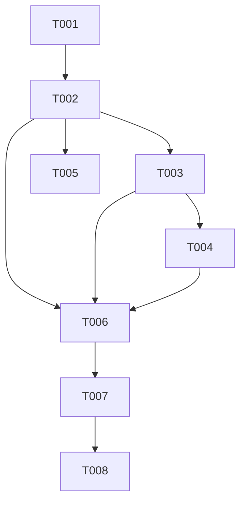

# Tasks: F004

## Metrics

| Metric | Value |
|--------|-------|
| Total tasks | 8 |
| Parallelizable | 2 tasks (T005, T006) |
| User stories | US1, US2, US3 |
| Phases | 4 |

## Phase 1: Foundational

- [x] T001 [S] Add `.list_rules` variant to Instruction tagged union in `src/domain/instruction.zig`
  - Acceptance: New `.list_rules = struct {}` variant exists, co-located unit test verifies correct active tag, `zig build test-domain` passes

## Phase 2: User Story 1 (P1 - Must Have)

- [x] T002 [M] [US1] Implement `.list_rules` handler in `src/application/query_handler.zig`
  - Acceptance: `handle()` iterates `rule_storage.rules.valueIterator()`, formats shell rules as `<id> <pattern> shell <command>\n` and AMQP rules as `<id> <pattern> amqp <dsn> <exchange> <routing_key>\n` (per FR-005) into body, returns success with null body when no rules exist; co-located unit tests for rules-present and empty cases pass

- [x] T003 [S] [US1] Add `.list_rules` to scheduler read-only skip group in `src/application/scheduler.zig`
  - Acceptance: `.list_rules` instruction skips `append_to_logfile`; co-located unit test verifies no persistence write

- [x] T004 [M] [US1] Wire LISTRULES through TCP server in `src/infrastructure/tcp_server.zig`
  - Acceptance: `build_instruction()` parses `LISTRULES` command (with and without trailing args), `free_instruction_strings()` handles `.list_rules` as no-op, `write_response()` formats multi-line body with request_id prefix, LISTRULES added to error handling block (dead code for consistency — LISTRULES cannot fail parsing since it takes no required args); co-located unit tests for parsing, trailing args, multi-line formatting, and empty result pass

## Phase 3: User Story 2 & 3 (P2/P3)

- [x] T005 [S] [P] [US3] Add AMQP runner formatting test in `src/application/query_handler.zig`
  - Acceptance: Co-located unit test sets AMQP rule, sends `.list_rules`, verifies body contains `amqp <dsn> <exchange> <routing_key>`

- [x] T006 [M] [P] [US1,US2,US3] Write functional tests in `src/functional_tests.zig`
  - Acceptance: Tests cover: RULE SET 2 shell rules then LISTRULES returns both in body, LISTRULES with no rules returns success with null body, LISTRULES with AMQP rule includes all runner fields

## Phase 4: Documentation

- [x] T007 [S] [E] Update protocol documentation with LISTRULES command examples
  - Files: `docs/reference/protocol.md`, `docs/user-guide/writing-rules.md`, `README.md`
  - Acceptance: Protocol reference includes LISTRULES request/response format with examples for shell and AMQP rules

- [x] T008 [S] [E] Update feature roadmap status for F004
  - Files: `docs/reference/README.md`, `docs/user-guide/README.md`
  - Acceptance: F004 marked as implemented in roadmap/tracking docs

## Dependencies

## Execution Notes

- T001 must complete first — Zig's exhaustive switch checking will cause compile errors until `.list_rules` is handled everywhere
- T002, T003, T004 are sequential: after T001 adds the variant, each task adds switch arms that the next task depends on to compile. The code will not compile until all three are done, but implementing them in order (query_handler → scheduler → tcp_server) minimizes intermediate compile errors
- T005 and T006 can run in parallel within Phase 3
- NFR-001 (<10ms for 1000 rules) is satisfied by design (linear scan of in-memory hash map) — no benchmark task needed
- NFR-002 (single allocation) is a design guideline enforced by code review, not a separate test
- The implement workflow runs `make lint`, `make test`, `make build` automatically — do NOT duplicate as tasks
- Sizes S/M/L indicate relative complexity, NOT time estimates

