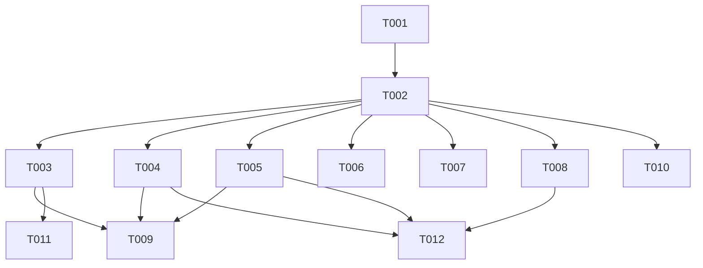

# Tasks: F005

## Metrics

| Metric | Value |
|--------|-------|
| Total tasks | 12 |
| Parallelizable | 6 tasks (T003-T008 within phases) |
| User stories | US1, US2, US3, US4 |
| Phases | 4 |

## Phase 1: Foundational

- [x] T001 [S] [US2] Implement `log_level_to_std` mapping function in `src/main.zig`
  - Acceptance: Maps all 6 `Config.LogLevel` variants to `std.log.Level` equivalents (`off` → handled in logFn, `error` → `.err`, `warn` → `.warn`, `info` → `.info`, `debug` → `.debug`, `trace` → `.debug`); co-located tests cover all 6 branches

- [x] T002 [M] [US2] Define `pub const std_options` with custom `logFn` in `src/main.zig`
  - Acceptance: `std_options.log_level` set to `.debug` (comptime most permissive); `logFn` reads module-level `var runtime_log_level`, short-circuits if message level below threshold, formats as `[LEVEL] message\n` to stderr; co-located tests verify filtering and format output using buffer writer

## Phase 2: User Story 1 — Startup Feedback (P1)

- [x] T003 [S] [US1] Add startup log messages in `main()` in `src/main.zig`
  - Acceptance: After config load: `std.log.info` with config path (or "default") and active log level; after TCP bind: `std.log.info` with listening address; replace `std.debug.print` at line ~89 with `std.log.err`

- [x] T004 [S] [US1] Add database load log message in `run_database` in `src/main.zig`
  - Acceptance: After `scheduler.load()`: `std.log.info` with loaded job count and rule count via `scheduler.job_storage.jobs.count()` and `scheduler.rule_storage.rules.count()`; replace silent `catch {}` on `scheduler.load()` with `catch |err| std.log.warn(...)` 

## Phase 3: User Story 3 — Connection Lifecycle (P2)

- [x] T005 [S] [P] [US3] Add client connect/disconnect logging in `src/infrastructure/tcp_server.zig`
  - Acceptance: Pass `conn.address` from `accept()` through `connection_worker` to `handle_connection`; `std.log.info` on `handle_connection` entry (client connected, including peer address) and exit (client disconnected)

## Phase 4: User Story 4 — Instruction & Execution Logging (P3)

- [x] T006 [S] [P] [US4] Add instruction-received DEBUG logging in `src/infrastructure/tcp_server.zig`
  - Acceptance: `std.log.debug` after instruction is built in `handle_connection`, logging instruction type via `@tagName`

- [x] T007 [S] [P] [US4] Add execution-outcome DEBUG logging in `src/application/scheduler.zig`
  - Acceptance: `std.log.debug` in `tick()` when execution result is processed, logging job identifier and success/failure outcome

- [x] T008 [S] [P] [US4] Add OOM visibility for execution result append in `src/application/execution_client.zig`
  - Acceptance: `execution_client.zig` `resolve()` retains `catch {}` per hexagonal architecture (logging belongs to interfaces layer); co-located tests verify `resolve()` does not propagate allocation errors and silently discards results on OOM

## Phase 5: Documentation

- [x] T009 [S] [E] [US1] Update `docs/tutorials/getting-started.md` with realistic log output
  - Acceptance: Replace "No output is expected on startup" with example showing `[INFO] config: default`, `[INFO] listening on 127.0.0.1:5678`, `[INFO] loaded 0 jobs, 0 rules`; update Step 7 restart section

- [x] T010 [S] [P] [E] [US2] Update `docs/reference/configuration.md` log level description
  - Acceptance: `log_level` field description states it controls runtime verbosity of stderr output with all 6 valid values listed

## Phase 6: Cleanup

- [x] T011 [S] [R] Remove dead `std.debug.print` call in `src/main.zig`
  - Acceptance: No remaining `std.debug.print` calls in `src/main.zig`; all output goes through `std.log`

- [x] T012 [S] [P] [R] Replace silent `catch {}` with logging in `src/main.zig`; keep `catch {}` in infra/application layers (hexagonal boundary)
  - Acceptance: `std.debug.print` replaced by `std.log.err` in main.zig; `scheduler.load() catch {}` replaced by `catch |err| std.log.warn(...)` in main.zig; infra/application layers retain `catch {}` (logging belongs to interfaces layer per hexagonal architecture)

## Dependencies

## Execution Notes

- Tasks marked [P] can run in parallel within their phase
- T001 and T002 are sequential: mapping function must exist before logFn references it
- T003-T008 all depend on T002 (std_options must be wired first) but are independent of each other; T005-T008 edit different files and are all parallelizable
- T005 requires passing `conn.address` from `accept()` through `connection_worker` to `handle_connection` to satisfy FR-005 (client address in logs)
- T011 and T012 overlap with T003/T004/T005/T008 edits — if cleanup is done inline during those tasks, mark T011/T012 as complete without separate passes
- The implement workflow runs `make test`, `make lint`, `make build` automatically — do NOT duplicate as tasks
- Sizes S/M/L indicate relative complexity, NOT time estimates

