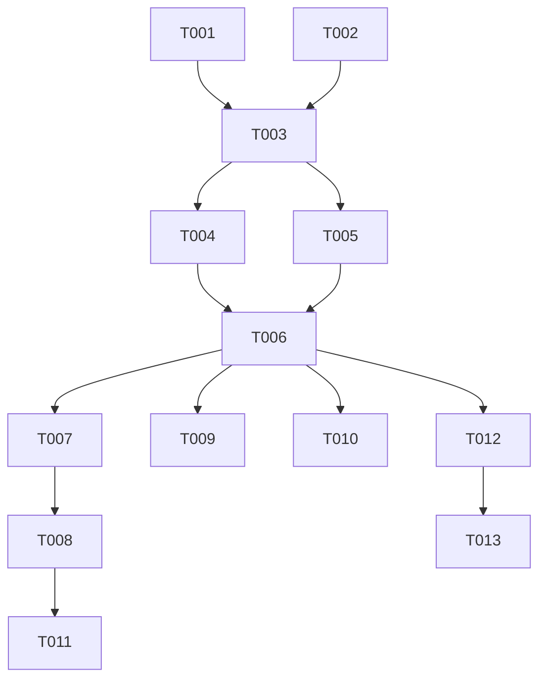

# Tasks: F006

## Metrics

| Metric | Value |
|--------|-------|
| Total tasks | 13 |
| Parallelizable | 4 tasks (T007, T009, T010, T012 after T006) |
| User stories | US1, US2, US3, US4, US5 |
| Phases | 5 |

## Phase 1: Foundational — Config & Build

- [x] T001 [M] [US2,US3] Add `controller_tls_cert` and `controller_tls_key` optional fields to Config in `src/interfaces/config.zig`
  - Parse both fields under `[controller]` section as `?[]const u8`, validate both-or-neither constraint returning `ConfigError.InvalidValue` on partial config, free allocations in `deinit`
  - Acceptance: Unit tests pass for: both fields set, neither set (backward compat), only cert set (error), only key set (error), deinit frees without leak

- [x] T002 [M] [US1] Update `build.zig` for conditional OpenSSL linking
  - Add `exe.linkSystemLibrary("ssl")` and `exe.linkSystemLibrary("crypto")` conditionally when TLS source files are present. Add `exe.linkLibC()`. Ensure plaintext-only builds remain zero-dependency.
  - Acceptance: `zig build` succeeds with and without system libssl installed (conditional path); binary links against libssl when TLS is enabled

## Phase 2: TLS Infrastructure

- [x] T003 [L] [US1] Create TlsContext OpenSSL adapter in `src/infrastructure/tls_context.zig`
  - Wrap OpenSSL `SSL_CTX` via `@cImport`/C linkage. Implement `create()` loading PEM cert+key files returning initialized context or error, per-connection `accept()` performing TLS handshake on raw fd, and `deinit()` for cleanup. Use `errdefer` for all OpenSSL resource cleanup paths.
  - Acceptance: Unit tests pass for: valid cert/key creation, nonexistent cert path returns error, invalid PEM returns error, deinit cleans up resources

- [x] T004 [L] [US1,US2,US4] Add Connection tagged union to `src/infrastructure/tcp_server.zig`
  - Define `Connection = union(enum) { plain: std.net.Stream, tls: TlsStream }` with `read()`, `write()`, `close()` methods. Replace all direct `std.net.Stream` references in `handle_connection` and `write_response` with Connection. Update SocketPair test helper to return Connection. Consolidate duplicate Context structs in handle_connection tests (lines 940-953, 985-996) into shared test helper.
  - Acceptance: All existing tcp_server unit tests pass using Connection.plain variant; read/write/close behave identically to raw Stream for plain variant; no duplicate test Context structs

- [x] T005 [S] [E] Add tls_context to barrel export in `src/infrastructure.zig`
  - Acceptance: `infrastructure.tls_context` is importable from other modules

## Phase 3: Wiring

- [x] T006 [M] [US1,US2] Wire TLS context through main in `src/main.zig`
  - Extend `ControllerContext` with `tls_context: ?*TlsContext` field. In `main()`, conditionally initialize TLS context from config cert/key paths before spawning controller thread (set-before-spawn pattern). Pass to `TcpServer.init`. In `TcpServer.start`, perform TLS handshake on accepted connections when context is non-null, wrap in `Connection.tls`; otherwise wrap in `Connection.plain`.
  - Acceptance: ztick starts in plaintext mode with no TLS config; ztick starts with TLS when both cert/key configured; startup fails with clear error on bad cert/key

## Phase 4: Functional Tests

- [x] T007 [S] [P] Generate self-signed test certificates as fixtures in `test/fixtures/tls/`
  - Create `cert.pem` and `key.pem` using openssl CLI for test use. Add `test/fixtures/tls/` path to `.gitignore` if certs should not be committed, or commit test-only self-signed certs.
  - Acceptance: Valid PEM files exist at `test/fixtures/tls/cert.pem` and `test/fixtures/tls/key.pem`

- [x] T008 [M] [P] [US1] Write functional test: TLS-enabled server accepts encrypted connections in `src/functional_tests.zig`
  - Start ztick with TLS config pointing to test fixtures. Connect via TLS client, send SET command, verify OK response over encrypted channel.
  - Acceptance: Test passes — SET command processed identically over TLS

- [x] T009 [S] [P] [US2] Write functional test: plaintext mode unaffected by TLS feature in `src/functional_tests.zig`
  - Start ztick without TLS config. Connect via plaintext, send commands. Verify identical behavior to pre-TLS implementation.
  - Acceptance: Test passes — existing plaintext behavior preserved

- [x] T010 [S] [P] [US3] Write functional test: partial TLS config rejected at startup in `src/functional_tests.zig`
  - Start ztick with only `tls_cert` set. Verify startup exits with config error. Repeat with only `tls_key`.
  - Acceptance: Test passes — both partial configs produce `ConfigError.InvalidValue`

- [x] T011 [S] [US4] Write functional test: failed TLS handshake does not crash server in `src/functional_tests.zig`
  - Connect to TLS-enabled server with plaintext client (garbage bytes). Verify connection rejected. Then connect with valid TLS client and verify server still accepts.
  - Acceptance: Test passes — server remains available after failed handshake

## Phase 5: Documentation

- [x] T012 [S] [E] [US5] Write ADR 0003 documenting OpenSSL dependency decision in `docs/ADR/0003-openssl-tls-dependency.md`
  - Document context (zero-dep principle vs stdlib lacking server TLS), decision (system OpenSSL via C interop), consequences (platform dependency on libssl, conditional linking preserves zero-dep for plaintext builds).
  - Acceptance: ADR follows existing format from `docs/ADR/0001-*.md` and `0002-*.md`

- [x] T013 [S] [E] [US5] Update README.md with TLS configuration section
  - Add TLS setup instructions: config fields, self-signed cert generation example, verification steps. Document build prerequisite (`libssl-dev`). Update `build.zig.zon` comment if needed.
  - Acceptance: README contains TLS configuration section with working example commands

## Dependencies

## Execution Notes

- T002 (build.zig) must precede T003 (TlsContext) — `@cImport` for OpenSSL requires linkSystemLibrary in build.zig to compile
- T004 merges the original Connection abstraction with duplicate Context struct cleanup (plan cleanup opportunity)
- T007, T009, T010, T012 are parallelizable once main wiring (T006) is complete
- T008 waits for T007 (needs test certificates); T011 waits for T008 (needs working TLS test)
- The implement workflow runs `make lint`, `make test`, `make build` automatically between phases
- T012-T013 are documentation edits handled without TDD cycle
- Conditional OpenSSL linking (T002) ensures non-TLS builds remain zero-dependency per ADR 0002
