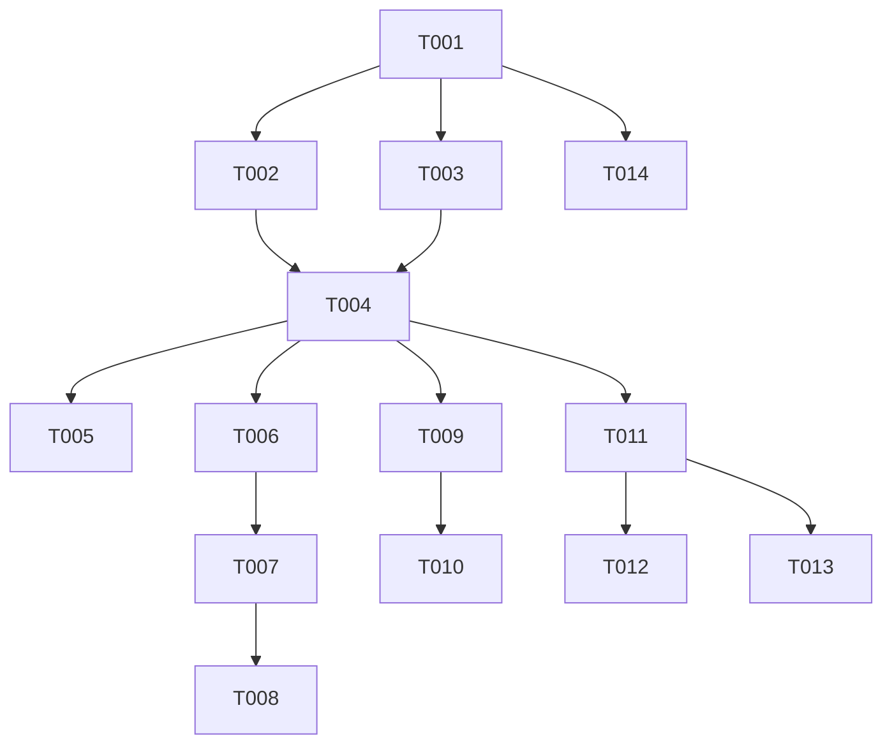

# Tasks: F007

## Metrics

| Metric | Value |
|--------|-------|
| Total tasks | 14 |
| Parallelizable | 4 tasks (cross-phase) |
| User stories | US1, US2, US3, US4 |
| Phases | 6 |

## Phase 1: Foundational

- [x] T001 [M] Extend CLI parser with Command tagged union and dump subcommand dispatch in `src/interfaces/cli.zig`
  - Acceptance: `parse_slice` returns `.server` for no args/`--config`, returns `.dump` with DumpOptions for `dump logfile.bin`, returns errors for missing path and invalid format. Backward compat preserved for all existing server-mode arg patterns.

- [x] T002 [S] Wire Command dispatch into main entry point in `src/main.zig` and register dump module in `src/interfaces.zig`
  - Acceptance: `main.zig` switches on Command union — `.server` runs existing logic, `.dump` calls `dump.run_dump()`. `interfaces.zig` barrel exports dump module. Builds without errors.

## Phase 2: User Story 1 (P1 - Must Have) — Text Output

- [x] T003 [M] [US1] Implement text entry formatter in `src/interfaces/dump.zig`
  - Acceptance: `format_entry_text` produces `SET <id> <ts> <status>`, `RULE SET <id> <pattern> shell <cmd>`, `RULE SET <id> <pattern> amqp <dsn> <exchange> <routing_key>`, `REMOVE <id>`, `REMOVERULE <id>` for all Entry union variants. Unit tests cover all 5 entry types.

- [x] T004 [M] [US1] Implement `run_dump` core logic in `src/interfaces/dump.zig`
  - Acceptance: Opens logfile read-only, reads contents, parses frames via `logfile.parse()`, decodes entries via `encoder.decode()`, writes text-formatted output to stdout. Exits 0 on success, exits 1 with stderr message on file-not-found. Handles empty logfile (no output, exit 0). Handles partial trailing frame with stderr warning. Handles unrecognized entry type byte by printing warning to stderr with byte offset and skipping the frame.
  - Note: Uses `readToEndAlloc` (full file read) per plan decision — deviates from NFR-001 streaming requirement. Acceptable for initial delivery; streaming parse API deferred.

- [x] T005 [S] [P] [US1] Write functional tests for text dump in `src/functional_tests.zig`
  - Acceptance: Spawns `ztick dump <path>` as child process with logfile built from `build_logfile_bytes()`. Verifies stdout matches expected text lines for mixed entry types. Tests empty file (no output, exit 0) and missing file (stderr error, exit 1).

## Phase 3: User Story 2 (P1 - Must Have) — JSON Output

- [x] T006 [M] [US2] Implement JSON entry formatter in `src/interfaces/dump.zig`
  - Acceptance: `format_entry_json` produces valid NDJSON with `type`, `identifier`, and type-specific fields. Job entries include `execution` and `status`. Rule entries include nested `runner` object with `type`/`command` or `type`/`dsn`/`exchange`/`routing_key`. Removal entries have `type` and `identifier` only. Unit tests cover all 5 variants. String values are properly JSON-escaped.

- [x] T007 [S] [US2] Wire `--format` flag into `run_dump` output path in `src/interfaces/dump.zig`
  - Acceptance: `run_dump` switches on format option to call text or JSON formatter. `--format json` produces NDJSON output, `--format text` (default) produces text output.

- [x] T008 [S] [P] [US2] Write functional tests for JSON dump in `src/functional_tests.zig`
  - Acceptance: Spawns `ztick dump <path> --format json`, verifies each stdout line is valid JSON with correct field values for mixed entry types.

## Phase 4: User Story 3 (P2 - Should Have) — Compact Mode

- [x] T009 [M] [US3] Implement `--compact` deduplication in `src/interfaces/dump.zig`
  - Acceptance: Two-pass approach: first pass tracks last index per ID and flags removal IDs, second pass emits only entries at their last position whose ID is not removed. Works with both text and JSON format. Unit tests verify deduplication of duplicate SETs and omission of removed entries.

- [x] T010 [S] [P] [US3] Write functional tests for compact mode in `src/functional_tests.zig`
  - Acceptance: Logfile with duplicate SET entries and SET+REMOVE sequences. `--compact` outputs only latest SET per ID, omits removed entries. `--compact --format json` produces compacted NDJSON.

## Phase 5: User Story 4 (P3 - Nice to Have) — Follow Mode

- [x] T011 [M] [US4] Implement `--follow` poll loop in `src/interfaces/dump.zig`
  - Acceptance: After initial dump, polls file size via `stat()` with 1-second sleep interval. Reads new bytes from last offset, parses and formats new entries. Works with both text and JSON formats.

- [x] T012 [S] [US4] Implement SIGINT/SIGTERM clean exit for follow mode in `src/interfaces/dump.zig`
  - Acceptance: Registers signal handler via `std.posix.sigaction`. Sets atomic flag to stop poll loop. Process exits cleanly with code 0 on signal within 1 second.

- [x] T013 [S] [P] [US4] Write functional test for follow mode in `src/functional_tests.zig`
  - Acceptance: Spawns `ztick dump --follow`, appends entries to logfile after initial dump, verifies new entries appear on stdout within 2 seconds. Sends SIGINT and verifies clean exit.

## Phase 6: Cleanup

- [x] T014 [S] [R] Remove `UnknownFlag` handling for positional args in `src/interfaces/cli.zig`
  - Acceptance: First positional arg is either "dump" or falls through to server mode. `UnknownFlag` only triggers for actual unknown flags like `--verbose`. Existing tests still pass.

## Dependencies

## Execution Notes

- Tasks marked [P] are functional tests that can run in parallel with each other if phases are collapsed (T005, T008, T010, T013)
- The implement workflow runs `make lint`, `make test`, `make build` automatically — do NOT duplicate as tasks
- Sizes S/M/L indicate relative complexity, NOT time estimates
- T003 and T006 formatters can be developed in parallel once T001 lands
- Follow mode (Phase 5) is P3 priority — can be deferred if timeline is tight

