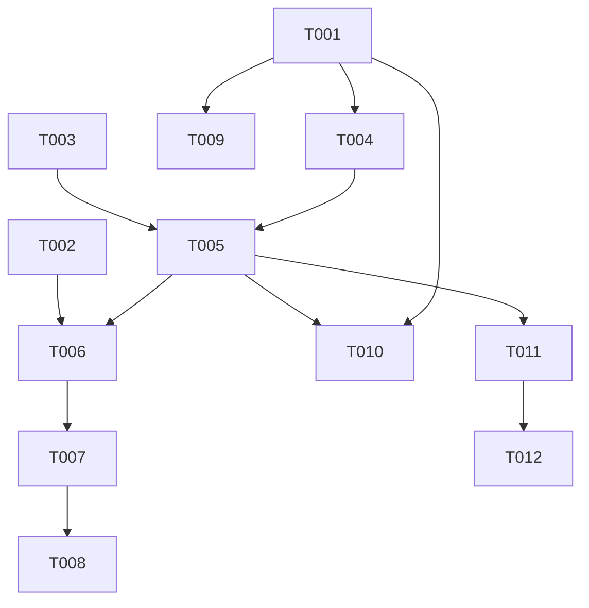

# Tasks: F008

## Metrics

| Metric | Value |
|--------|-------|
| Total tasks | 12 |
| Parallelizable | 4 tasks |
| User stories | US1, US2, US3, US4 |
| Phases | 4 |

## Phase 1: Foundational

- [x] T001 [M] [P] [US3, US4] Create `PersistenceBackend` tagged union with `MemoryPersistence` and `LogfilePersistence` structs in `src/infrastructure/persistence/backend.zig`
  - Acceptance: `MemoryPersistence` implements `append`, `load`, `deinit` storing raw encoder bytes in `ArrayList([]u8)`; `LogfilePersistence` struct defined with `logfile_path`, `logfile_dir`, `fsync_on_persist`, `load_arena` fields and stub methods; `PersistenceBackend` union dispatches to both variants; co-located tests pass with GPA leak detection for memory backend round-trip (append N entries → load → verify order and content)

- [x] T002 [S] [P] [US1, US2] Add `PersistenceMode` enum and `database_persistence` field to Config in `src/interfaces/config.zig`
  - Acceptance: Parses `persistence = "memory"` and `persistence = "logfile"` in `[database]` section; defaults to `.logfile` when key absent; returns `ConfigError.InvalidValue` for unrecognized values; co-located tests cover all three cases

- [x] T003 [S] [E] Update barrel export `src/infrastructure/persistence.zig` to export `backend` module
  - Acceptance: `@import("persistence").backend` resolves to `backend.zig`

## Phase 2: US3 — Scheduler Decoupled from File Persistence (P2)

- [x] T004 [L] [US3] Extract file operations from `Scheduler` into `LogfilePersistence.append()` and `LogfilePersistence.load()` in `src/infrastructure/persistence/backend.zig`
  - Acceptance: `LogfilePersistence.append()` writes length-prefixed encoded entry to logfile with optional fsync; `LogfilePersistence.load()` reads and parses logfile returning decoded entries; existing logfile round-trip behavior preserved in co-located tests

- [x] T005 [L] [US3] Refactor `Scheduler` to depend on `?PersistenceBackend` instead of direct file fields in `src/application/scheduler.zig`
  - Acceptance: `logfile_path`, `logfile_dir`, `load_arena`, `fsync_on_persist` fields removed from Scheduler; `append_to_logfile()` replaced with delegation to `PersistenceBackend.append()`; `load()` delegates to `PersistenceBackend.load()`; `null` backend means no persistence; all existing scheduler tests adapted and passing.
  - Verification: `grep -E 'openFile|createFile|\.write\(|\.read\(' src/application/scheduler.zig` returns no matches — no direct file operations remain in scheduler.

- [x] T006 [M] [US3] Update `DatabaseContext` and `run_database` in `src/main.zig` to construct and pass `PersistenceBackend` based on config
  - Acceptance: `DatabaseContext` replaces `logfile_path`, `logfile_dir`, `fsync_on_persist` fields with `persistence: ?PersistenceBackend`; `run_database` constructs appropriate backend variant from config; background compression skipped when backend is `.memory` or `null` (`null` = no persistence, pre-existing behavior when no logfile_path configured).

## Phase 3: US1 — In-Memory Persistence (P1)

- [x] T007 [S] [US1] Wire memory persistence config to `MemoryPersistence` backend construction in `src/main.zig`
  - Acceptance: When `persistence = "memory"` in config, scheduler receives `PersistenceBackend{ .memory = ... }`; no files created on disk; `logfile_path` and `fsync_on_persist` config values ignored

- [x] T008 [M] [US1, US2] Write functional tests for memory backend in `src/functional_tests.zig`
  - Acceptance: Spawns `ztick` as child process with config containing `persistence = "memory"`, sends SET command via TCP, verifies job executes correctly. Confirms no files created in temp directory (FR-005). Existing logfile functional tests still pass unchanged.

- [x] T009 [S] [P] [US4] Write format consistency test in `src/infrastructure/persistence/backend.zig`
  - Acceptance: Encodes an entry via `encoder.encode()`, appends to memory backend, retrieves stored bytes via `load()`, compares against direct `encoder.encode()` output — verifies memory backend stores identical raw encoder bytes without length-prefix framing.

- [x] T010 [S] [P] [US1] Write scheduler round-trip test with memory backend in `src/application/scheduler.zig`
  - Acceptance: Creates scheduler with memory backend, sends SET and RULE SET mutations, reloads from backend, verifies all entries restored correctly with zero memory leaks

## Phase 4: Cleanup

- [x] T011 [S] [R] Remove `append_to_logfile()` method from `src/application/scheduler.zig` if still present after refactor
  - Acceptance: Method deleted, no callers remain, no direct file operations in scheduler.zig

- [x] T012 [S] [R] Remove orphaned file-related imports from `src/application/scheduler.zig`
  - Acceptance: No `std.fs` or `std.posix` imports remain in scheduler unless used for non-persistence purposes

## Dependencies

## Execution Notes

- T001 and T002 and T003 can run in parallel (no dependencies between them)
- T009 and T010 can run in parallel within Phase 3
- Phase 2 is the riskiest — T005 touches the most code; run tests after each sub-step
- The implement workflow runs `make lint`, `make test`, `make build` automatically — do NOT duplicate as tasks
- Sizes S/M/L indicate relative complexity, NOT time estimates

