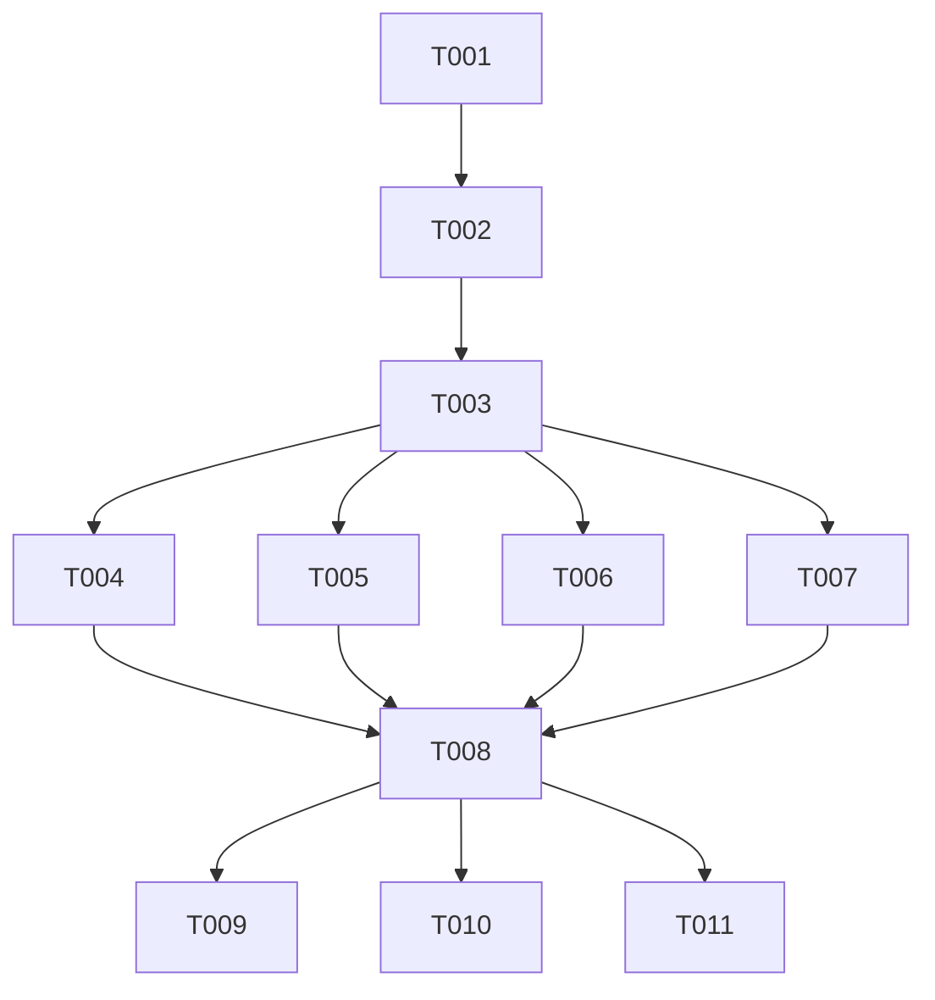

# Tasks: F009

## Metrics

| Metric | Value |
|--------|-------|
| Total tasks | 11 |
| Parallelizable | 4 tasks |
| User stories | US1, US2, US3, US4 |
| Phases | 3 |

## Phase 1: US4 - Configurable Compression Interval (Config Parsing)

- [x] T001 [S] [US4] Add `database_compression_interval` field to Config struct and parse from `[database]` section in `src/interfaces/config.zig`
  - Acceptance: Default 3600 when key absent, parses valid u32 values, rejects negative/overflow with `ConfigError.InvalidValue`, value 0 accepted (means disabled)

## Phase 2: US1 + US2 + US3 - Compression Scheduling in Tick Loop

- [x] T002 [M] [US1] Add compression scheduling fields to Scheduler struct (`compression_interval_ns`, `last_compression_ns`, `active_process`) in `src/application/scheduler.zig`
  - Acceptance: Fields initialized with defaults (interval=0, last=0, process=null); existing tests unaffected since interval 0 means disabled

- [x] T003 [M] [US1] Implement compression trigger logic in `tick()` — check elapsed time, perform file rotation (rename logfile to `.to_compress`), spawn compression via `Process.execute()` in `src/application/scheduler.zig`
  - Acceptance: Compression spawns after interval elapses for `.logfile` backend; logfile renamed to `.to_compress` before spawn; fresh logfile created for new writes

- [x] T004 [S] [US2] Add `.memory` backend guard in tick compression path in `src/application/scheduler.zig`
  - Acceptance: Zero compression activity (no timer checks, no file ops, no thread spawns) when backend is `.memory`; NFR-003 zero overhead

- [x] T005 [S] [P] [US1] Implement skip-if-running logic — poll `Process.status()`, skip cycle when `.running` in `src/application/scheduler.zig`
  - Acceptance: Overlapping compression cycles skipped per FR-004; completed process cleaned up (deinit + set null)

- [x] T006 [S] [P] [US3] Implement non-blocking shutdown — do not join compression thread on deinit in `src/application/scheduler.zig`
  - Acceptance: Scheduler deinit completes without waiting for active compression; FR-005 satisfied

- [x] T007 [S] [P] [US1] Add compression failure warning and `.to_compress` file retention in `src/application/scheduler.zig`
  - Acceptance: Failed compression logs warning via `std.log`; `.to_compress` file left intact for next cycle per FR-008

## Phase 3: Runtime Wiring + Functional Tests

- [x] T008 [S] [US1] Wire compression config into runtime — add `compression_interval_ns` to `DatabaseContext`, pass to Scheduler, handle leftover `.to_compress` at startup (FR-009) in `src/main.zig`
  - Acceptance: `DatabaseContext` carries interval; import suppression `_ = infrastructure_persistence_background` replaced with actual usage; leftover `.to_compress` compressed at startup

- [x] T009 [M] [US1] Write functional test: logfile backend triggers compression after interval and produces deduplicated `.compressed` file in `src/functional_tests.zig`
  - Acceptance: Scheduler with short interval produces `.compressed` with deduplicated entries; SC-001 validated

- [x] T010 [S] [P] [US2] Write functional test: memory backend produces no compression artifacts in `src/functional_tests.zig`
  - Acceptance: No `.to_compress` or `.compressed` files created; no background threads spawned; SC-004 validated

- [x] T011 [S] [P] [US1] Write functional test: leftover `.to_compress` file is compressed at startup in `src/functional_tests.zig`
  - Acceptance: Pre-existing `.to_compress` file is compressed before periodic timer starts; resulting `.compressed` file contains deduplicated entries; FR-009 validated

## Dependencies

## Execution Notes

- Tasks marked [P] can run in parallel within phase
- The implement workflow runs `zig build test-all --summary all` automatically — do NOT duplicate as tasks
- T002 and T003 are sequential within Phase 2 because T003 depends on the fields added in T002
- T004, T005, T006, T007 are independent aspects of tick() behavior and can be implemented in parallel after T003
- T009, T010, T011 are independent functional tests and can run in parallel after T008
- No cleanup phase needed — the only cleanup (removing `_ = infrastructure_persistence_background`) is handled as part of T008's wiring work

