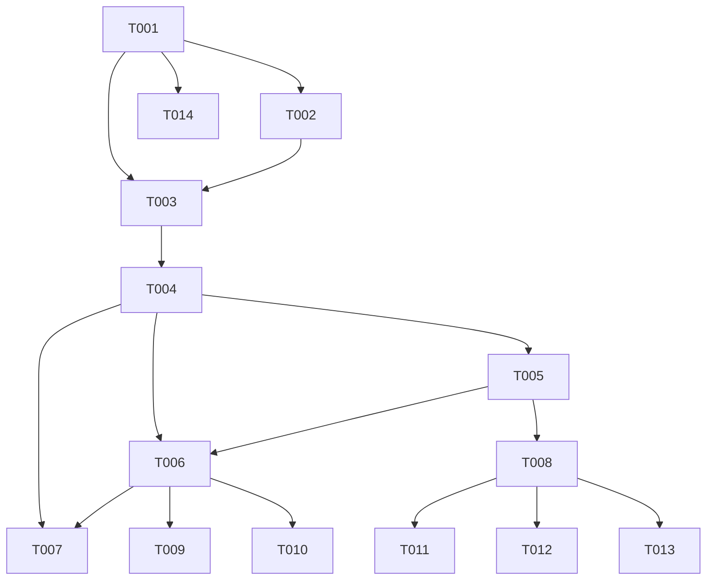

# Tasks: F010

## Metrics

| Metric | Value |
|--------|-------|
| Total tasks | 14 |
| Parallelizable | 4 tasks |
| User stories | US1, US2, US3, US4 |
| Phases | 6 |

## Phase 1: Foundational — SDK Dependency & Configuration

- [x] T001 [S] [US1] [E] Add zig-o11y/opentelemetry-sdk v0.1.1 dependency
  - Run `zig fetch --save "git+https://github.com/zig-o11y/opentelemetry-sdk#v0.1.1"`. Configure build.zig to expose SDK module to application and infrastructure layers. Create empty `src/infrastructure/telemetry.zig` with barrel export in `src/infrastructure.zig`. Verify build succeeds.
  - Acceptance: `zig build` succeeds with SDK dependency resolved. `zig build test-infrastructure` discovers telemetry module.

- [x] T002 [M] [US3] Parse `[telemetry]` config section in `src/interfaces/config.zig`
  - Add TelemetryConfig struct (enabled: bool, endpoint: ?[]const u8, service_name: []const u8, flush_interval_ms: u32) with defaults (disabled, null, "ztick", 5000). Parse keys, reject unknown keys with ConfigError, reject enabled=true without endpoint, reject malformed endpoints. Allocator.dupe for endpoint string, free in deinit.
  - Acceptance: 9 unit tests pass — defaults when absent, enabled+endpoint, custom service_name, custom flush_interval, unknown key rejection, enabled-without-endpoint rejection, malformed endpoint rejection, default service_name, default flush_interval

## Phase 2: SDK Provider Setup

- [x] T003 [M] [US1] Initialize SDK providers with OTLP exporters in `src/infrastructure/telemetry.zig`
  - Create setup function that takes TelemetryConfig and allocator, returns initialized MeterProvider + TracerProvider + LoggerProvider with OTLP exporters configured (endpoint, service_name, flush_interval). When telemetry disabled, return null providers (SDK noop). Create shutdown function that flushes and deinits all providers. Wire std.log bridge for OTLP log export (warn+ level).
  - Acceptance: 3 unit tests pass — setup returns providers with OTLP exporters configured, setup with disabled config returns null providers, shutdown flushes and cleans up providers

- [x] T004 [S] [US1] Create SDK instrument factory in `src/infrastructure/telemetry.zig`
  - Create function that takes MeterProvider and returns named instruments: Counter(i64) for jobs_scheduled/jobs_executed/jobs_removed/persistence_compactions, Histogram(f64) for execution_duration_ms (buckets [1,5,10,50,100,500,1000,5000,30000]), UpDownCounter(i64) for rules_active/connections_active. Return struct of instruments.
  - Acceptance: Instruments created with correct names (`ztick.jobs.scheduled`, etc.) and histogram bucket boundaries

## Phase 3: User Story 1 — Metrics Instrumentation (P1)

- [x] T005 [M] [US1] Wire SDK instruments into Scheduler in `src/application/scheduler.zig`
  - Add optional instrument fields to Scheduler (following persistence pattern). Increment jobs_scheduled on SET, jobs_removed on REMOVE, jobs_executed on execution result (with success/failure attribute), record execution_duration_ms histogram, update rules_active gauge, increment persistence_compactions on compression. Null instruments perform no operations.
  - Acceptance: 6 unit tests pass — SET increments scheduled counter, REMOVE increments removed counter, execution result increments executed counter with success/failure, execution records duration histogram, compression increments compactions counter, null instruments performs no operations (zero-overhead path)

- [x] T006 [M] [US1] Wire telemetry into main.zig lifecycle in `src/main.zig`
  - Call SDK provider setup when telemetry enabled (skip when disabled). Create instruments via factory. Pass instruments to Scheduler/TickContext. Pass connections_active gauge to TCP server context. Call SDK shutdown in shutdown sequence (before thread joins).
  - Acceptance: Telemetry disabled path creates no providers, no instruments. Enabled path initializes SDK and shuts down cleanly.

- [x] T007 [S] [US1] Wire connections_active gauge into TCP server in `src/infrastructure/tcp_server.zig`
  - Pass SDK UpDownCounter to TcpServer context. Increment on client connect, decrement on client disconnect. Null counter path performs no operations.
  - Acceptance: Unit tests pass — gauge increments on connect, decrements on disconnect, null counter performs no operations (US1-4)

## Phase 4: User Story 2 — Traces Instrumentation (P2)

- [x] T008 [M] [US2] Add trace instrumentation to TCP request and job execution lifecycles in `src/application/scheduler.zig` and `src/main.zig`
  - Use SDK Tracer to create request span covering TCP receive → parse → dispatch → response in TickContext. Create execution span covering trigger → runner invocation → exit code → response routing. Propagate trace context via TickContext so both spans share trace_id. Add span attributes (runner_type, exit_code, duration).
  - Acceptance: Unit tests pass — SET request creates request span, job execution creates execution span with runner_type/exit_code attributes, request and execution spans share same trace_id

## Phase 5: Functional Tests

- [x] T009 [S] [P] Write functional test: telemetry disabled produces no exporter thread in `tests/functional_tests.zig`
  - Start ztick with no [telemetry] section. Verify no HTTP requests made, no additional threads spawned.
  - Acceptance: Functional test passes confirming zero-overhead disabled path (NFR-001)

- [x] T010 [M] [P] Write functional test: telemetry enabled exports metrics to collector in `tests/functional_tests.zig`
  - Start ztick with telemetry enabled pointing at a mock HTTP endpoint. Send SET, REMOVE, RULE SET commands. Verify OTLP payloads received at /v1/metrics with expected counter/gauge values.
  - Acceptance: Functional test passes confirming end-to-end metric export (US1)

## Phase 6: Cleanup

- [x] T011 [S] [P] [R] Document `ztick.connections.active` gauge overlap with `TcpServer.active_connections` in code comment in `src/infrastructure/tcp_server.zig`
  - Add brief comment noting the standalone atomic can be consolidated with the telemetry gauge in a future PR (per plan cleanup opportunity).
  - Acceptance: Comment added, no behavioral changes

- [x] T012 [S] [P] [E] Add example telemetry configuration to `example/` in `example/config-telemetry.toml`
  - Create example TOML showing [telemetry] section with all keys and descriptive comments.
  - Acceptance: Example file parses correctly with ztick config parser

- [x] T013 [S] [E] Add ADR-0004 reference to project documentation
  - Verify `docs/ADR/0004-opentelemetry-sdk-dependency.md` is present and consistent with implementation.
  - Acceptance: ADR file exists and references match actual SDK version and usage

- [x] T014 [S] [E] Update build.zig.zon minimum_zig_version to 0.15.2
  - Change minimum_zig_version from "0.14.0" to "0.15.2" to match SDK requirement and actual Zig version in use.
  - Acceptance: `zig build` succeeds, minimum_zig_version is "0.15.2"

## Dependencies

## Execution Notes

- Tasks marked [P] can run in parallel within their phase
- The implement workflow runs `make lint`, `make test`, `make build` automatically between phases — do NOT duplicate
- SDK eliminates hand-rolled MetricRegistry, OTLP serializer, exporter thread, Span types — ~60% task reduction vs original plan
- Phase 3 is the core delivery — metrics instrumentation covers US1 (P1) and US3 (P1)
- Phase 4 (traces) and Phase 5 (logs via std.log bridge in T003) follow incremental delivery per spec
- T006 is the integration bottleneck — all prior components converge here
- Sizes S/M/L indicate relative complexity, NOT time estimates
- SDK noop providers replace custom `?*MetricRegistry` null-check pattern for zero-overhead disabled path
- US4 (logs) is handled by SDK std.log bridge wired in T003 — no separate log instrumentation tasks needed
