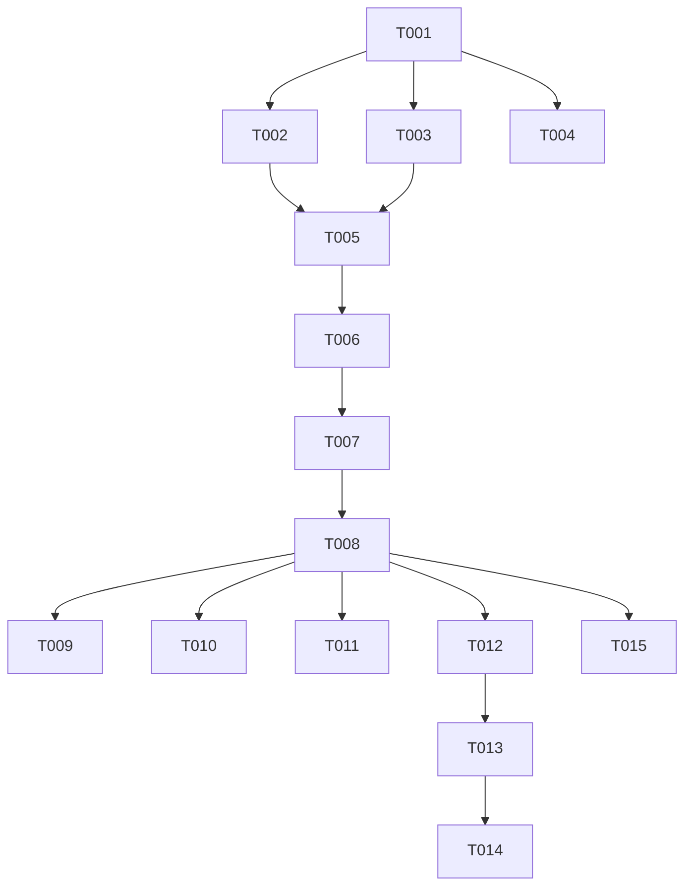

# Tasks: F011

## Metrics

| Metric | Value |
|--------|-------|
| Total tasks | 15 |
| Parallelizable | 5 tasks |
| User stories | US1, US2, US3, US4, US5 |
| Phases | 4 |

## Phase 1: Foundational — Domain and Application

- [x] T001 [S] [US5] Create Token and ClientIdentity structs in `src/domain/auth.zig`
  - Acceptance: Token has name/secret/namespace fields, ClientIdentity has name/namespace only (no secret per FR-011), barrel export added to `src/domain.zig`

- [x] T002 [M] [US1,US5] Implement TokenStore in `src/application/token_store.zig`
  - Acceptance: `authenticate(secret)` returns `?ClientIdentity` using `std.crypto.timing_safe.eql` via SHA-256 digest comparison (FR-008), `is_authorized(identity, identifier)` checks namespace prefix with wildcard support (FR-005), rejects duplicate secrets and empty namespaces at init (FR-009), barrel export added to `src/application.zig`

## Phase 2: Infrastructure — Auth File Parser

- [x] T003 [M] [US5] Implement auth file TOML parser in `src/infrastructure/auth.zig`
  - Acceptance: Parses `[token.<name>]` sections with `secret` and `namespace` fields, returns `[]Token` array, rejects missing secret/empty namespace/duplicate secrets at parse time, barrel export added to `src/infrastructure.zig`

- [x] T004 [S] [P] [US5] Create test fixture TOML files in `test/fixtures/auth/`
  - Acceptance: `valid.toml` (2 tokens), `wildcard.toml` (namespace=*), `duplicate_secret.toml`, `missing_secret.toml`, `empty_namespace.toml` all present
  - Note: No dependency on T003; fixtures are standalone test data files

## Phase 3: User Story Integration — Config, Wiring, Handshake

- [x] T005 [S] [US3,US5] Extend Config with `controller_auth_file` in `src/interfaces/config.zig`
  - Acceptance: Optional `?[]const u8` field defaults to null, parsed from `[controller]` section, coexists with TLS fields, existing configs without `auth_file` behave identically (FR-003)

- [x] T006 [M] [US1,US3] Wire TokenStore into main.zig and TcpServer
  - Acceptance: `ControllerContext` gains `token_store: ?*TokenStore` field following `tls_context` pattern in `src/main.zig`, TokenStore initialized from auth file when configured, passed through to `connection_worker`

- [x] T007 [L] [US1] Implement AUTH handshake in `src/infrastructure/tcp_server.zig`
  - Acceptance: When auth enabled — requires `AUTH <secret>\n` as first command, responds `OK\n` on valid token / `ERROR\n` + close on invalid (FR-001, FR-002), 5-second read timeout via `SO_RCVTIMEO` (FR-010), non-AUTH first command rejected, second AUTH after success rejected

- [x] T008 [M] [US2,US4] Implement namespace enforcement in `src/infrastructure/tcp_server.zig`
  - Acceptance: SET/GET/REMOVE commands checked against client namespace prefix (FR-004), RULE SET checks both rule ID and pattern prefix (FR-007), QUERY results filtered to namespace prefix (FR-006), wildcard namespace `*` bypasses all checks (FR-005)

## Phase 4: Functional Tests

- [x] T009 [S] [P] [US1] Write functional test — valid AUTH followed by SET in `src/functional_tests.zig`
  - Acceptance: Connect, send `AUTH <valid-secret>\n`, receive `OK\n`, send SET command, receive OK

- [x] T010 [S] [P] [US1] Write functional test — invalid AUTH closes connection in `src/functional_tests.zig`
  - Acceptance: Connect, send `AUTH <wrong-secret>\n`, receive `ERROR\n`, connection closed

- [x] T011 [S] [P] [US3] Write functional test — no auth_file allows commands without AUTH in `src/functional_tests.zig`
  - Acceptance: Start with default config (no auth_file), send SET directly, receive OK — zero behavioral change

- [x] T012 [S] [US2] Write functional test — namespace allow/deny for SET in `src/functional_tests.zig`
  - Acceptance: Auth with `deploy.` namespace, `SET deploy.x` succeeds, `SET backup.x` returns ERROR

- [x] T013 [S] [US2] Write functional test — wildcard namespace and QUERY filtering in `src/functional_tests.zig`
  - Acceptance: Wildcard token can SET any identifier; scoped token QUERY returns only matching-prefix results (FR-006)

- [x] T014 [S] [US4] Write functional test — RULE SET namespace enforcement in `src/functional_tests.zig`
  - Acceptance: Scoped token `RULE SET deploy.r deploy. shell echo ok` succeeds, `RULE SET x backup. shell echo ok` returns ERROR

- [x] T015 [S] [P] [US1] Write functional test — auth timeout closes connection in `src/functional_tests.zig`
  - Acceptance: Connect with auth enabled, send no data, verify connection closed after 5s timeout (FR-010, US1 scenario 4)

## Dependencies

## Execution Notes

- Tasks marked [P] can run in parallel within their phase
- T004 has no dependency on T003; fixtures are standalone data files created in parallel with the parser
- T007 and T008 are sequential — handshake must work before namespace enforcement
- T009–T011 and T015 are parallelizable; T012–T014 are sequential (each builds on prior test state/fixtures)
- Risk: `std.crypto.timing_safe.eql` requires fixed-size arrays — T002 must SHA-256 hash both secrets to 32-byte digests before comparison
- Risk: 5s auth timeout in T007 requires `std.posix.setsockopt` with `SO.RCVTIMEO` on raw fd
- The implement workflow runs `make lint`, `make test`, `make build` automatically — do NOT duplicate as tasks

