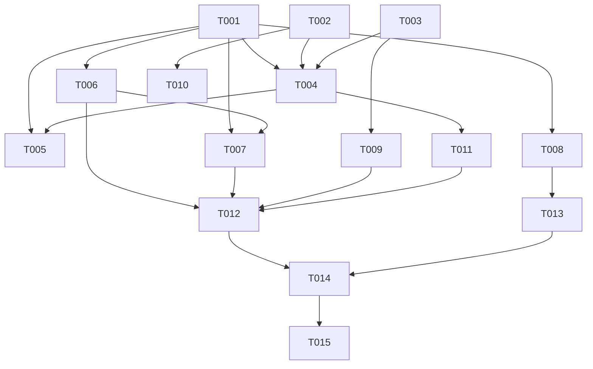

# Tasks: F012

## Metrics

| Metric | Value |
|--------|-------|
| Total tasks | 15 |
| Parallelizable | 5 tasks |
| User stories | US1, US2, US3, US4 |
| Phases | 6 |

## Phase 1: Domain Foundation

- [x] T001 [S] [P] Add `stat` variant to `Instruction` tagged union in `src/domain/instruction.zig`
  - Acceptance: `stat` variant defined as `struct {}` (no payload, same as `list_rules`); unit test asserts active tag; compiles with `zig build test-domain`

- [x] T002 [S] [P] Add `ServerStats` struct to `src/domain/server_stats.zig` and export via `src/domain.zig`
  - Acceptance: struct holds all 15 metric fields as typed values (`uptime_ns: i128`, `connections: usize`, `jobs_total: usize`, `jobs_planned: usize`, `jobs_triggered: usize`, `jobs_executed: usize`, `jobs_failed: usize`, `rules_total: usize`, `executions_pending: usize`, `executions_inflight: usize`, `persistence: []const u8`, `compression: []const u8`, `auth_enabled: bool`, `tls_enabled: bool`, `framerate: u16`); `pub fn format(self: ServerStats, allocator: Allocator) ![]const u8` returns multi-line key-value body; unit test verifies format output; barrel export in `domain.zig`

## Phase 2: Application Layer

- [x] T003 [M] [US1] Extend `Scheduler` with stat context fields in `src/application/scheduler.zig`
  - Acceptance: `Scheduler` gains `startup_ns: i128`, `active_connections: *std.atomic.Value(usize)`, `auth_enabled: bool`, `tls_enabled: bool`, `framerate: u16`; `init()` updated to accept these; existing tests updated to pass new fields

- [x] T004 [M] [US1] Handle `.stat` instruction in `Scheduler.handle_query()` in `src/application/scheduler.zig`
  - Acceptance: `.stat` instruction short-circuits before `QueryHandler.handle()`; builds `ServerStats` from scheduler state (`job_storage`, `rule_storage`, `execution_client`, `active_connections`, `active_process`, `persistence`); formats body via `ServerStats.format()`; returns `Response{ .success = true, .body = body }`; unit test verifies response body contains expected metrics

- [x] T005 [S] [US1] Add `.stat` arms to `append_to_persistence` switch and telemetry switch in `src/application/scheduler.zig`
  - Acceptance: `.stat` returns `null` in `append_to_persistence` (no logfile entry); `.stat` is no-op in telemetry counter switch; exhaustive switches compile

## Phase 3: Infrastructure Layer

- [x] T006 [S] [P] Parse `STAT` command in `build_instruction()` in `src/infrastructure/tcp_server.zig`
  - Acceptance: input `STAT` produces `Instruction{ .stat = .{} }`; extra arguments silently ignored (same behavior as LISTRULES); unit test `build_instruction parses STAT command` passes

- [x] T007 [S] [P] Add `.stat` to `free_instruction_strings()` and `write_response()` in `src/infrastructure/tcp_server.zig`
  - Acceptance: `.stat => {}` in `free_instruction_strings` (no allocated strings); `.stat` added to `.query, .list_rules` match arm in `write_response()` for multi-line output; exhaustive switches compile

- [x] T008 [S] [US4] Skip namespace authorization for `STAT` in connection handler in `src/infrastructure/tcp_server.zig`
  - Acceptance: `.stat` bypasses `is_authorized()` check (server-level command, not job-scoped); authenticated clients of any namespace can call STAT; unauthenticated clients on auth-enabled server are still rejected (standard auth enforcement applies before command dispatch)

## Phase 4: Interfaces Layer

- [x] T009 [M] [US1] Pass stat context from `src/main.zig` to `Scheduler` initialization
  - Acceptance: `startup_ns: i128` captured via `std.time.nanoTimestamp()` at boot; `active_connections` atomic pointer from `TcpServer` passed to `Scheduler`; `auth_enabled`, `tls_enabled`, `framerate` derived from config and passed to `Scheduler.init()`; server starts and runs correctly with new init signature

## Phase 5: Testing

- [x] T010 [S] [P] Add unit test for `ServerStats.format()` in `src/domain/server_stats.zig`
  - Acceptance: test creates `ServerStats` with known values; verifies format output contains all 15 `key value\n` lines in expected order; verifies boolean fields render as `0`/`1`

- [x] T011 [M] [US1] Add unit tests for `Scheduler.handle_request` with `.stat` in `src/application/scheduler.zig`
  - Acceptance: test creates scheduler with known state (jobs in various statuses, rules, execution client state); sends `.stat` request; verifies response success and body contains correct metric values; verifies no persistence entry created

- [x] T012 [S] [US2] [US3] Add functional tests for STAT over TCP in `src/functional_tests.zig`
  - Acceptance: test sends `req-1 STAT\n` to running server; verifies multi-line response with `req-1 <key> <value>\n` format; verifies terminal `req-1 OK\n`; verifies `connections` metric reflects active connection count; verifies `uptime_ns` is positive

- [x] T013 [S] [US4] Add functional test for STAT with authentication in `src/functional_tests.zig`
  - Acceptance: with auth enabled, authenticated client can call STAT regardless of namespace prefix; unauthenticated STAT rejected; STAT does not leak job-scoped data outside client namespace (only server-level metrics)

## Phase 6: Documentation

- [x] T014 [S] [E] Update protocol reference with STAT command in `docs/reference/protocol.md`
  - Acceptance: STAT listed under Commands section with syntax `STAT` (no args); response format documented with all 15 metrics; example request/response shown; noted as read-only, no persistence

- [x] T015 [S] [E] Update README protocol commands table in `README.md`
  - Acceptance: STAT added to protocol commands table with description "Server health and status metrics"; command count updated

## Dependencies

## Implementation Notes

### Architectural Decision: STAT handled by Scheduler, not QueryHandler

STAT requires data from multiple scheduler-owned subsystems (execution_client, persistence, active_process, active_connections). Rather than extending QueryHandler with operational context it doesn't need for any other command, STAT is handled directly in `Scheduler.handle_query()` before delegating to QueryHandler. This keeps QueryHandler focused on job/rule CRUD operations and maintains clean separation of concerns.

### Response Format

STAT uses the same multi-line response pattern as QUERY and LISTRULES:
- Each metric line: `<request_id> <key> <value>\n`
- Terminal: `<request_id> OK\n`
- Body built by `ServerStats.format()` as newline-separated `key value` pairs

### Compression Status Mapping

The `active_process` field maps to compression status:
- `null` → `idle`
- `process.status == .running` → `running`
- `process.status == .success` → `success`
- `process.status == .failure` → `failure`

### Namespace Authorization

STAT is explicitly excluded from namespace checks because it reports server-level metrics, not job-scoped data. The auth gate (requiring AUTH before any command) still applies when auth is enabled.
